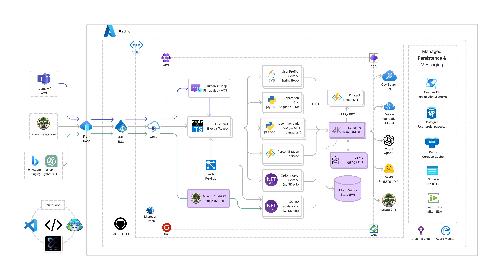
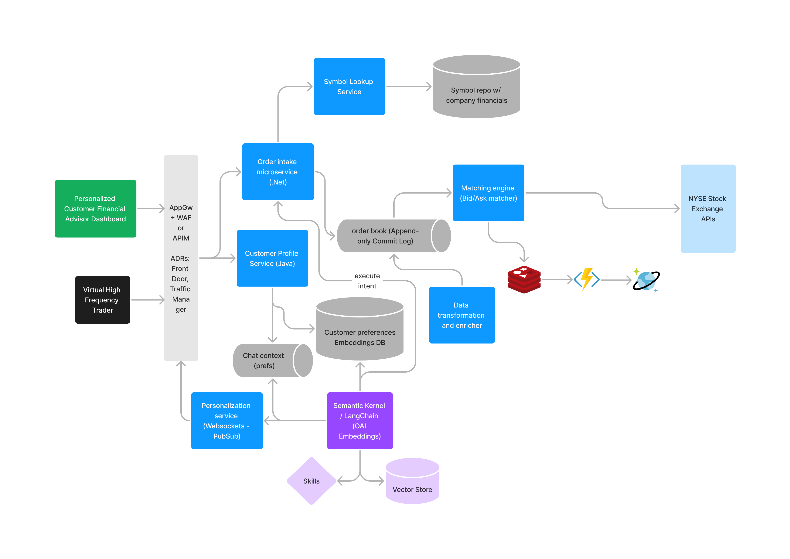
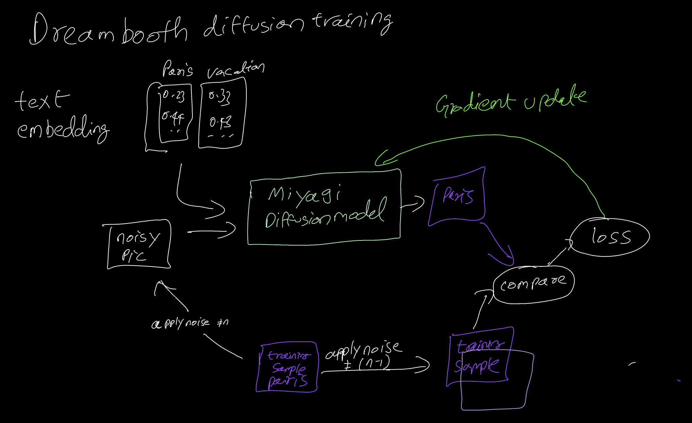

# Project Miyagi - Financial coach

>  “start with the customer experience and work backwards for the technology” - Steve Jobs
>
>  "Systems with AI will replace systems without AI"

Project Miyagi is the codebase for an [envisioning workshop](https://github.com/appdevgbb/miyagi-workshop) to rethink intelligent application design, development, and deployment. It serves as a deep-dive sandbox to get hands-on with emerging programming paradigms that leverage foundation models. In addition, it introduces, to traditional software engineers, nascent design patterns in prompt engineering (chain-of-thought, few-shot, in-context), vectorizing for long term memory, and affordances to LLMs.

The project also includes examples of usage for popular frameworks and orchestrators like [Semantic Kernel](https://github.com/microsoft/semantic-kernel), [LangChain](https://github.com/hwchase17/langchain#readme), [Jarvis](https://github.com/microsoft/JARVIS), vector stores ([Qdrant](https://qdrant.tech/), [Chroma](https://www.trychroma.com/), [Milvus](https://milvus.io/docs), [Pinecone](https://www.pinecone.io/)), [ControlNet](https://github.com/lllyasviel/ControlNet). Additionally, it features foundation Models from Azure OpenAI and [Cognitive Services](https://azure.microsoft.com/en-us/blog/announcing-a-renaissance-in-computer-vision-ai-with-microsofts-florence-foundation-model). Utilize this project to gain insights as you modernize and transform your applications with AI and fine-tune your private data to build your own private copilot.

Embedded with intelligence and built on a scalable event-driven architecture, Project Miyagi emphasizes customer-centricity. It challenges you to rethink how AI can curate and create hyper-personalized user interactions, whether in a line-of-business (LOB) or consumer-facing app. It features an easy-to-understand use case that offers concrete examples of how these new AI platforms and architectures, supported by Azure, can be leveraged for valuable insights.

This polyglot codebase relies on a multitude of microservices, choreographing retail and high-frequency trading. It includes generative text and images for personalized financial coaching, summarization, and agent-like orchestration. Built on a cloud-native EDA backbone, the architecture and codebase ensures enterprise-grade quality attributes such as availability, scalability, and maintainability.

Embark on a journey to transform your applications into cutting-edge, intelligent systems with the self-guided workshop and discover the art of the possible.

*Work in Progress*

## Tech Stack

<TODO>

- Azure OpenAI
  - text-davinci-003
  - text-embedding-ada-002
  - whisper
  - dall-e
- [Semantic Kernel](https://github.com/microsoft/semantic-kernel)
- [Jarvis](https://github.com/microsoft/JARVIS)
- [LangChain](https://github.com/hwchase17/langchain#readme)
- [Foundation Models from CogServices](https://azure.microsoft.com/en-us/blog/announcing-a-renaissance-in-computer-vision-ai-with-microsofts-florence-foundation-model/)
- [Qdrant](https://qdrant.tech/solutions/)
- [Chroma](https://www.trychroma.com/)
- [ControlNet](https://github.com/lllyasviel/ControlNet)
- [Azure Deployment Environments](https://azure.microsoft.com/en-us/products/deployment-environments/)

### Partial Implementations

Due to the rapid pace of advancements in foundation models, we are incrementally implementing use cases for Miyagi in the experiments folder. So far, we have the following implemented:

1. [Knowledge Graph memory using Langchain's entity cache](./ancillary/experiments/langchain/Memory_Usecases.ipynb)
2. [Qdrant vector store for embeddings via Langchain](./ancillary/experiments/langchain/qdrant_miyagi_example)
3. [MS Graph API intent invoked via Semantic Kernel's skills](./ancillary/experiments/semantic-kernel/ms-graph-chain)
4. [Miyagi prompt engineered chat interaction](./ancillary/experiments/langchain/chat) using LangChain's PromptTemplate 
5. [Azure OpenAI GPT-3.5 basic flow](./ancillary/experiments/az-openai)
6. [GPT-3.5-turbo and Whisper-1 usage to transcribe audio and demonstrate few-shot example](./ancillary/experiments/gpt-3.5-turbo)

### WIP - Architecture

### WIP - Generative image use case architecture with Dreambooth

### Contributing

This project welcomes contributions and suggestions.  Most contributions require you to agree to a
Contributor License Agreement (CLA) declaring that you have the right to, and actually do, grant us
the rights to use your contribution. For details, visit https://cla.opensource.microsoft.com.

When you submit a pull request, a CLA bot will automatically determine whether you need to provide
a CLA and decorate the PR appropriately (e.g., status check, comment). Simply follow the instructions
provided by the bot. You will only need to do this once across all repos using our CLA.

This project has adopted the [Microsoft Open Source Code of Conduct](https://opensource.microsoft.com/codeofconduct/).
For more information see the [Code of Conduct FAQ](https://opensource.microsoft.com/codeofconduct/faq/) or
contact [opencode@microsoft.com](mailto:opencode@microsoft.com) with any additional questions or comments.
