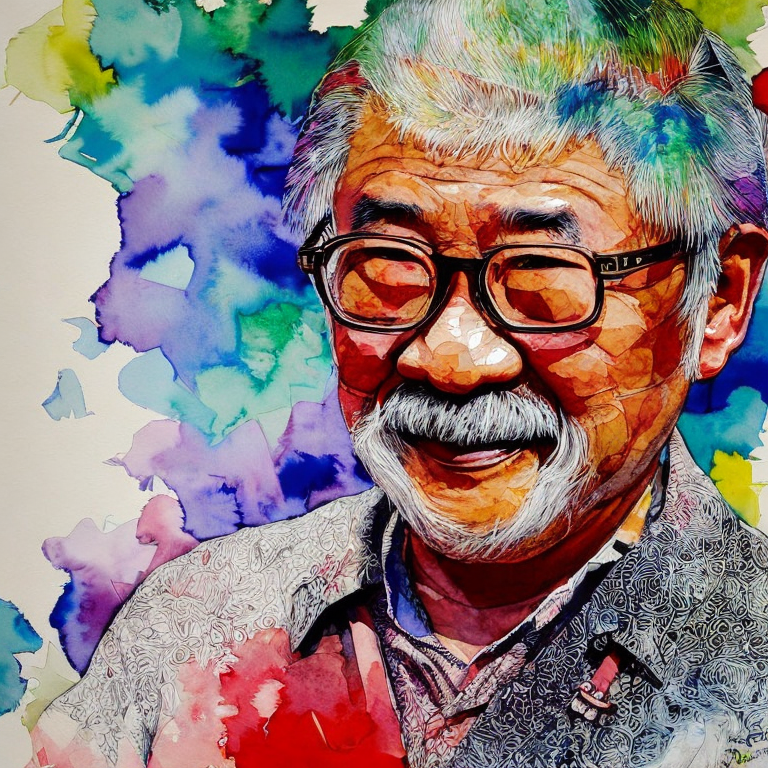

# Project Miyagi - Financial coach

>  “start with the customer experience and work backwards for the technology” - Steve Jobs
>
>  "Systems with AI will replace systems without AI"

This is a sample to demonstrate AI-first architecture and user experiences. It is also a sandbox to showcase emerging programming paradigms in generative AI such as
prompt engineering (chain-of-thought, few-shot, in-context), embeddings, conversational memory stores etc. In addition, it has usage examples of nascent frameworks such as 
[Semantic Kernel](https://github.com/microsoft/semantic-kernel), [LangChain](https://github.com/hwchase17/langchain#readme), vector stores ([Chroma](https://www.trychroma.com/)/[Pinecone](https://www.pinecone.io/)), [SD-InstructPix2Pix](https://github.com/timothybrooks/instruct-pix2pix), [ControlNet](https://github.com/lllyasviel/ControlNet),
as well as Foundation Models from Azure OpenAI and 
[Cognitive Services](https://azure.microsoft.com/en-us/blog/announcing-a-renaissance-in-computer-vision-ai-with-microsofts-florence-foundation-model). Leverage this to gain insights as you modernize and transform your applications with AI and fine-tune your private data to build your own private copilot.

Project Miyagi is embedded with intelligence and built on a scalable event-driven architecture. With a focus on customer-centricity, it challenges you to rethink how AI can elevate and hyper-personalize your 
customers' experiences, whether it's a line-of-business (LOB) or consumer-facing app.
It includes real-world customer use cases and pain points in the financial sector, 
providing an easily understandable scenario to gain valuable insights.

This polyglot codebase relies on a multitude of microservices, 
choreographing retail and high-frequency trading,
including generative text and images for personalized financial coaching, summarization, and agent-like orchestration. It is built on a cloud-native EDA backbone to ensure enterprise-grade quality attributes such as availability, scalability, and maintainability.

Take the first step towards transforming your applications into cutting-edge, intelligent systems with the self-guided workshop to discover the art of the possible.

WIP

## Tech stack

<TODO>

- [Azure OpenAI](https://azure.microsoft.com/en-us/products/cognitive-services/openai-service)
  - text-davinci-003
  - whisper
  - dall-e
- [Semantic Kernel](https://github.com/microsoft/semantic-kernel)
- [LangChain](https://github.com/hwchase17/langchain#readme)
- [Foundation models from CogServices](https://azure.microsoft.com/en-us/blog/announcing-a-renaissance-in-computer-vision-ai-with-microsofts-florence-foundation-model/)
- [Chroma](https://www.trychroma.com/)
- [ControlNet](https://github.com/lllyasviel/ControlNet)
- Temporal
- DreamFusion

### Partial implementations

We are incrementally implementing use cases for Miyagi in the experiments folder due to the rapid clip of advancements in foundation models. So far, we have the following implemented:

1. [Knowledge Graph memory using Langchain's entity cache](./ancillary/experiments/langchain/Memory_Usecases.ipynb)
2. [MS Graph API intent invoked via Semantic Kernel's skills](./ancillary/experiments/semantic-kernel/ms-graph-chain)
3. [Miyagi prompt engineered chat interaction](./ancillary/experiments/langchain/chat) using LangChain's PromptTemplate 
4. [Azure OpenAI GPT-3.5 basic flow](./ancillary/experiments/az-openai)
5. [GPT-3.5-turbo and Whisper-1 usage to transcribe audio and demonstrate few-shot example](./ancillary/experiments/gpt-3.5-turbo)

### Contributing

This project welcomes contributions and suggestions.  Most contributions require you to agree to a
Contributor License Agreement (CLA) declaring that you have the right to, and actually do, grant us
the rights to use your contribution. For details, visit https://cla.opensource.microsoft.com.

When you submit a pull request, a CLA bot will automatically determine whether you need to provide
a CLA and decorate the PR appropriately (e.g., status check, comment). Simply follow the instructions
provided by the bot. You will only need to do this once across all repos using our CLA.

This project has adopted the [Microsoft Open Source Code of Conduct](https://opensource.microsoft.com/codeofconduct/).
For more information see the [Code of Conduct FAQ](https://opensource.microsoft.com/codeofconduct/faq/) or
contact [opencode@microsoft.com](mailto:opencode@microsoft.com) with any additional questions or comments.
