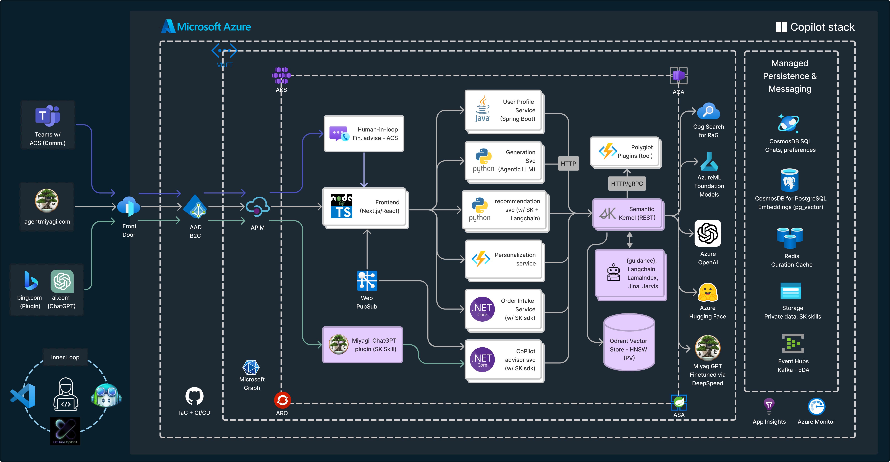
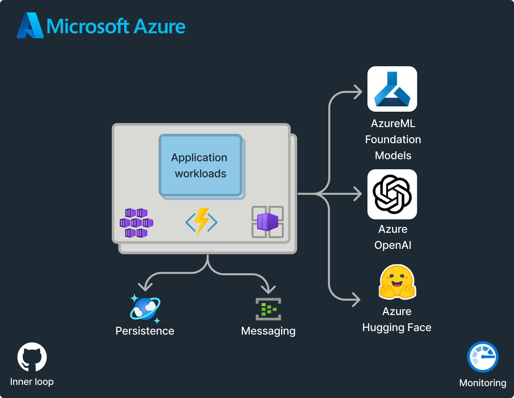

# Project Miyagi - Intelligent App Sample

>  “start with the customer experience and work backwards for the technology” - Steve Jobs
>
>  Systems with AI will replace systems without AI

Project Miyagi serves as the foundation for an [envisioning workshop](https://github.com/Azure-Samples/intelligent-app-workshop) that reimagines the design, development, and deployment of intelligent applications. It demonstrates that integrating intelligence transcends a simple chat interface and permeates every aspect of the end-user experience, utilizing enriched data to generate personalized interactions and effectively address individual needs. Through a comprehensive exploration of a financial coaching use case, Miyagi offers hands-on experience with cutting-edge programming paradigms that harness the power of foundation models in every workflow. Additionally, it introduces traditional software engineers to emerging design patterns in prompt engineering (chain-of-thought, few-shot, in-context), vectorization for long-term memory, and the affordances provided by LLMs.

> **Note**  
> *Work in Progress*. Meanwhile, signup at [intelligentapp.dev](https://intelligentapp.dev) for updates and checkout our related repo that showcases Generative AI capabilities for cloud-native, event-driven microservices: [Azure/reddog-solutions](https://github.com/Azure/reddog-solutions#readme). 

The project also includes examples of usage for popular frameworks and orchestrators like [Semantic Kernel](https://github.com/microsoft/semantic-kernel), [LangChain](https://github.com/hwchase17/langchain#readme), [Jarvis](https://github.com/microsoft/JARVIS), vector stores ([Qdrant](https://qdrant.tech/), [Chroma](https://www.trychroma.com/), [Milvus](https://milvus.io/docs), [Pinecone](https://www.pinecone.io/)), and generative image utilities such as [DreamFusion](https://huggingface.co/thegovind/reddogpillmodel512) and [ControlNet](https://github.com/lllyasviel/ControlNet). Additionally, it features foundation Models from Azure OpenAI and [Cognitive Services](https://azure.microsoft.com/en-us/blog/announcing-a-renaissance-in-computer-vision-ai-with-microsofts-florence-foundation-model). Utilize this project to gain insights as you modernize and transform your applications with AI and fine-tune your private data to build your own Copilot.

Embedded with intelligence and built on a scalable event-driven architecture, Project Miyagi emphasizes customer-centricity. It challenges you to rethink how AI can curate and create hyper-personalized user interactions, whether in a line-of-business (LOB) or consumer-facing app. It features an easy-to-understand use case that offers concrete examples of how these new AI platforms and architectures, supported by Azure, can be leveraged for valuable insights.

This polyglot codebase relies on a multitude of microservices, choreographing retail and high-frequency trading. It includes generative text and images for personalized financial coaching, summarization, and agent-like orchestration. Built on a cloud-native EDA backbone, the architecture and codebase ensures enterprise-grade quality attributes such as availability, scalability, and maintainability.

Embark on a journey to transform your applications into cutting-edge, intelligent systems with the self-guided workshop and discover the art of the possible.

### Partial Implementations

Due to the rapid pace of advancements in foundation models, we are incrementally implementing use cases for Miyagi in the experiments folder. So far, we have the following implemented:

1. [MVP with Personalize (Synthesis via Semantic Kernel) and Chat on Azure Container Apps](https://agentmiyagi.com)
1. [Miyagi ChatGPT Plugin](./python/chatgpt-plugin-miyagi)
1. [Knowledge Graph memory using Langchain's entity cache](./usecases/langchain/Memory_Usecases.ipynb)
1. [Qdrant vector store for embeddings via Langchain](./usecases/langchain/qdrant_miyagi_example)
1. [MS Graph API intent invoked via Semantic Kernel's skills](./usecases/semantic-kernel/ms-graph-chain)
1. [Miyagi prompt engineered chat interaction](./usecases/langchain/chat) using LangChain's PromptTemplate 
1. [Azure OpenAI GPT-3.5 basic flow](./usecases/az-openai)
1. [GPT-3.5-turbo and Whisper-1 usage to transcribe audio and demonstrate few-shot example](./usecases/gpt-3.5-turbo)
1. Reliability & Verifiability of model output (Responsible AI: Grounding, Retrieval augmented Generation (RaG) and Alignment) - coming soon
1. [DeepSpeed Chat](https://github.com/microsoft/DeepSpeedExamples/tree/master/applications/DeepSpeed-Chat) MiyagiGPT (BYO Weights w/ RLHF - Reinforcement Learning from Human Feedback) - coming soon

### Frontend
Interaction with foundation models is more than chat. This sample shows a few use cases 

### Architecture

#### High-level logical architecture

#### Semantic Kernel Orchestration for Miyagi usecase

#### In-context learning flow

#### 30k foot view

#### OSS Pre-trained Foundation Models

#### Initial ideation for EDA + SK flow

### Generative image use case architecture with Dreambooth
This will be similar to [reddog](https://reddog-solutions.com) product [image generation use case](https://huggingface.co/thegovind/reddogpillmodel512). 

## Tech Stack

<TODO>

- [Azure OpenAI](https://learn.microsoft.com/en-us/azure/cognitive-services/openai/concepts/models)
  - gpt-4
  - gpt-35-turbo
  - text-embedding-ada-002
- [Semantic Kernel](https://github.com/microsoft/semantic-kernel)
- [Azure HuggingFace Inference Endpoints](https://azure.microsoft.com/en-us/solutions/hugging-face-on-azure)
- [Jarvis](https://github.com/microsoft/JARVIS)
- [LangChain](https://github.com/hwchase17/langchain#readme)
- [Foundation Models from CogServices](https://azure.microsoft.com/en-us/blog/announcing-a-renaissance-in-computer-vision-ai-with-microsofts-florence-foundation-model/)
- [Qdrant](https://qdrant.tech/solutions/)
- [Microsoft DeepSpeed Chat](https://github.com/microsoft/DeepSpeedExamples/tree/master/applications/DeepSpeed-Chat)
- [Azure Web PubSub](https://azure.microsoft.com/en-us/products/web-pubsub)
- [Azure Communication Services (ACS)](https://learn.microsoft.com/en-us/azure/communication-services/overview#common-scenarios)
- [Azure Functions](https://azure.microsoft.com/en-ca/products/functions/)
- [AKS](https://azure.microsoft.com/en-us/products/kubernetes-service) / [ACA](https://azure.microsoft.com/en-us/products/container-apps)
- [Azure Monitor](https://learn.microsoft.com/en-us/azure/azure-monitor/)
- [Cosmos DB](https://azure.microsoft.com/en-us/products/cosmos-db/)
- [Azure Database for PostgreSQL](https://azure.microsoft.com/en-us/products/postgresql)
- [Azure Redis Cache](https://azure.microsoft.com/en-us/products/cache)
- [Azure Storage](https://learn.microsoft.com/en-us/azure/storage/common/storage-introduction)
- [Apache Kafka on Azure Event Hubs](https://learn.microsoft.com/en-us/azure/event-hubs/azure-event-hubs-kafka-overview)
- [Github Actions](https://docs.github.com/en/actions)

### Contributing

This project welcomes contributions and suggestions.  Most contributions require you to agree to a
Contributor License Agreement (CLA) declaring that you have the right to, and actually do, grant us
the rights to use your contribution. For details, visit https://cla.opensource.microsoft.com.

When you submit a pull request, a CLA bot will automatically determine whether you need to provide
a CLA and decorate the PR appropriately (e.g., status check, comment). Simply follow the instructions
provided by the bot. You will only need to do this once across all repos using our CLA.

This project has adopted the [Microsoft Open Source Code of Conduct](https://opensource.microsoft.com/codeofconduct/).
For more information see the [Code of Conduct FAQ](https://opensource.microsoft.com/codeofconduct/faq/) or
contact [opencode@microsoft.com](mailto:opencode@microsoft.com) with any additional questions or comments.
