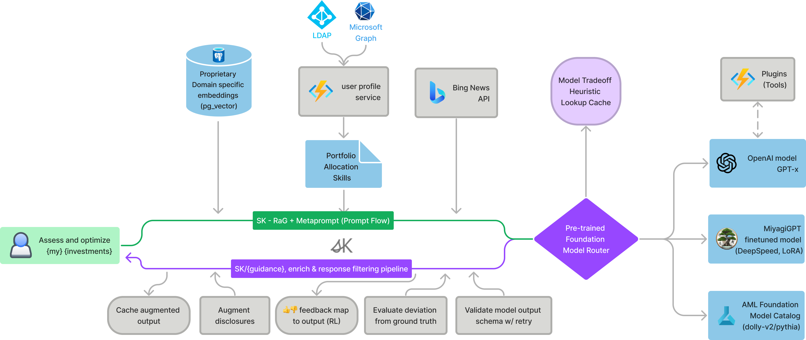
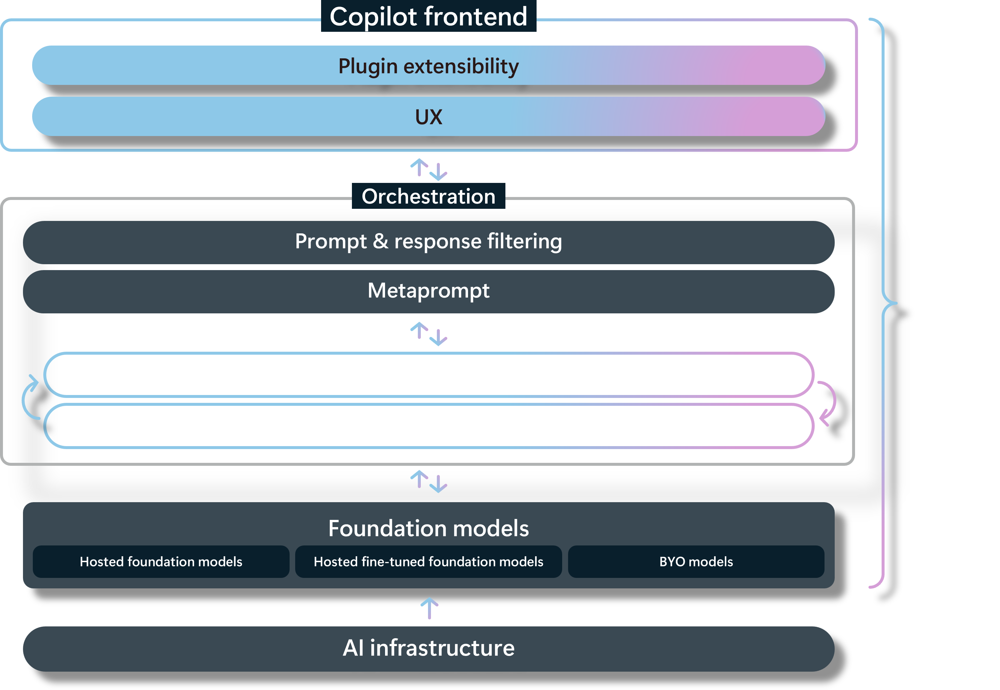

# Project Miyagi - Envisioning sample for [Copilot stack](https://learn.microsoft.com/en-us/semantic-kernel/overview/#semantic-kernel-is-at-the-center-of-the-copilot-stack)

>  “Start with the customer experience and work backwards for the technology” - Steve Jobs
>
>  "Change is the only constant" - Ancient wisdom

Project Miyagi showcases Microsoft's Copilot Stack in an [envisioning workshop](https://github.com/Azure-Samples/intelligent-app-workshop) aimed at designing, developing, and deploying enterprise-grade intelligent apps. By exploring both generative and traditional ML [use cases](https://iappwksp.com/wksp/05-use-cases/), Miyagi offers an experiential approach to developing AI-infused product experiences that enhance productivity and enable hyper-personalization. Additionally, the workshop introduces traditional software engineers to emerging design patterns in prompt engineering, such as chain-of-thought and retrieval-augmentation, as well as to techniques like vectorization for long-term memory, fine-tuning of OSS models, and plugins or tools for augmenting and grounding LLMs.

> **Note**  
> *Work in Progress*. Meanwhile, signup at [intelligentapp.dev](https://intelligentapp.dev) for updates and checkout our related repo that showcases Generative AI capabilities for cloud-native, event-driven microservices: [Azure/reddog-solutions](https://github.com/Azure/reddog-solutions#readme). 
>
> For a preview, catch the [recording on Cosmos DB Live TV](https://www.youtube.com/watch?v=V8dlEvXdGEM&t=144s)
>

The project includes examples of usage for [Semantic Kernel](https://learn.microsoft.com/en-us/semantic-kernel/overview/#semantic-kernel-is-at-the-center-of-the-copilot-stack), [Promptflow](https://promptflow.azurewebsites.net/overview-what-is-prompt-flow.html), [LlamaIndex](https://github.com/jerryjliu/llama_index), [LangChain](https://github.com/hwchase17/langchain#readme), vector stores ([Azure Cognitive Search](https://github.com/Azure/cognitive-search-vector-pr), [CosmosDB Postgres pgvector](https://learn.microsoft.com/en-us/azure/cosmos-db/postgresql/howto-use-pgvector), and generative image utilities such as [DreamFusion](https://huggingface.co/thegovind/reddogpillmodel512) and [ControlNet](https://github.com/lllyasviel/ControlNet). Additionally, it features fine-tuned foundation Models from AzureML such as Llama2. Utilize this project to gain insights as you modernize and transform your applications with AI and fine-tune your private data to build your own Copilots.

This polyglot codebase relies on a multitude of microservices, implementing several [use cases](https://iappwksp.com/wksp/05-use-cases/) using our Copilot stack. It includes generative text and images for personalized financial coaching, summarization, and agent-like orchestration. Built on a cloud-native event-diven architecture (EDA) backbone, the design and codebase ensures enterprise-grade quality attributes such as availability, scalability, and maintainability.

Embark on a journey to transform your applications into cutting-edge, intelligent systems with the self-guided workshop and discover the art of the possible.

### Partial Implementations

Due to the rapid pace of advancements in foundation models, we are incrementally implementing use cases for Miyagi in the experiments folder. So far, we have the following implemented:

1. [MVP with Personalize (Synthesis via Semantic Kernel) and Chat on Azure Container Apps](https://agentmiyagi.com).
    1. [Detailed breakdown and implementations](./services/README.md)
    1. [Quickstart with RaG](./sandbox/usecases/rag/dotnet/Getting-started.ipynb)
1. [Miyagi ChatGPT Plugin](./services/chatgpt-plugin/python)
1. [Knowledge Graph memory using Langchain's entity cache](./sandbox/experiments/langchain/Memory_Usecases.ipynb)
1. [Qdrant vector store for embeddings via Langchain](./sandbox/experiments/langchain/qdrant_miyagi_example)
1. [MS Graph API intent invoked via Semantic Kernel's skills](./sandbox/experiments/semantic-kernel/ms-graph-chain)
1. [Miyagi prompt engineered chat interaction](./sandbox/experiments/langchain/chat) using LangChain's PromptTemplate 
1. [Azure OpenAI GPT-3.5 basic flow](./sandbox/experiments/az-openai)
1. [GPT-3.5-turbo and Whisper-1 usage to transcribe audio and demonstrate few-shot example](./sandbox/experiments/gpt-3.5-turbo)
1. [DeepSpeed Chat](https://github.com/microsoft/DeepSpeedExamples/tree/master/applications/DeepSpeed-Chat) MiyagiGPT (BYO Weights w/ RLHF - Reinforcement Learning from Human Feedback) - coming soon

### Frontend
Interaction with foundation models is more than chat. This sample shows a few use cases 

### Architecture

#### High-level logical architecture

#### Semantic Kernel Orchestration for Miyagi usecase

#### In-context learning flow

#### 30k foot view

#### Prompt Flow

#### OSS Pre-trained Foundation Models

#### Initial ideation for EDA + SK flow

### Generative image use case architecture with Dreambooth
This will be similar to [reddog](https://reddog-solutions.com) product [image generation use case](https://huggingface.co/thegovind/reddogpillmodel512). 

## Tech Stack

### Copilot Stack

### Services and capabilities

- [Azure OpenAI](https://learn.microsoft.com/en-us/azure/cognitive-services/openai/concepts/models)
  - gpt-4
  - gpt-35-turbo
  - text-embedding-ada-002
- [Semantic Kernel](https://github.com/microsoft/semantic-kernel)
- [Use your own data with Azure OpenAI](https://learn.microsoft.com/en-us/azure/ai-services/openai/use-your-data-quickstart?tabs=command-line&pivots=rest-api#example-curl-commands)
- [AzureML PromptFlow](https://learn.microsoft.com/en-us/azure/machine-learning/prompt-flow/overview-what-is-prompt-flow?view=azureml-api-2)
- [TypeChat](https://microsoft.github.io/TypeChat)
- [Azure Functions](https://azure.microsoft.com/en-ca/products/functions/)
- [APIM](https://learn.microsoft.com/en-us/azure/api-management/)
- [Service Bus](https://learn.microsoft.com/en-us/azure/service-bus-messaging/service-bus-messaging-overview)
- [Event Grid](https://learn.microsoft.com/en-us/azure/event-grid/overview)
- [Logic Apps](https://learn.microsoft.com/en-us/azure/logic-apps/logic-apps-overview)
- [AKS](https://azure.microsoft.com/en-us/products/kubernetes-service) / [ACA](https://azure.microsoft.com/en-us/products/container-apps)
- [Cosmos DB](https://azure.microsoft.com/en-us/products/cosmos-db/)
- [Github Actions](https://docs.github.com/en/actions)
- [Azure Monitor](https://learn.microsoft.com/en-us/azure/azure-monitor/)
- [Azure DB for PostgreSQL](https://azure.microsoft.com/en-us/products/postgresql)
- [Azure Redis Cache](https://azure.microsoft.com/en-us/products/cache)
- [Azure Storage](https://learn.microsoft.com/en-us/azure/storage/common/storage-introduction)
- [Apache Kafka on Azure Event Hubs](https://learn.microsoft.com/en-us/azure/event-hubs/azure-event-hubs-kafka-overview)
- [Azure HuggingFace Inference Endpoints](https://azure.microsoft.com/en-us/solutions/hugging-face-on-azure)
- [LangChain](https://github.com/hwchase17/langchain#readme)
- [Foundation Models from CogServices](https://azure.microsoft.com/en-us/blog/announcing-a-renaissance-in-computer-vision-ai-with-microsofts-florence-foundation-model/)
- [Qdrant](https://qdrant.tech/solutions/)
- [Microsoft DeepSpeed Chat](https://github.com/microsoft/DeepSpeedExamples/tree/master/applications/DeepSpeed-Chat)
- [Azure Web PubSub](https://azure.microsoft.com/en-us/products/web-pubsub)
- [Azure Communication Services (ACS)](https://learn.microsoft.com/en-us/azure/communication-services/overview#common-scenarios)

### Contributing

This project welcomes contributions and suggestions.  Most contributions require you to agree to a
Contributor License Agreement (CLA) declaring that you have the right to, and actually do, grant us
the rights to use your contribution. For details, visit https://cla.opensource.microsoft.com.

When you submit a pull request, a CLA bot will automatically determine whether you need to provide
a CLA and decorate the PR appropriately (e.g., status check, comment). Simply follow the instructions
provided by the bot. You will only need to do this once across all repos using our CLA.

This project has adopted the [Microsoft Open Source Code of Conduct](https://opensource.microsoft.com/codeofconduct/).
For more information see the [Code of Conduct FAQ](https://opensource.microsoft.com/codeofconduct/faq/) or
contact [opencode@microsoft.com](mailto:opencode@microsoft.com) with any additional questions or comments.

### Disclaimer

This software is provided for demonstration purposes only. It is not intended to be relied upon for any purpose. The creators of this software make no representations or warranties of any kind, express or implied, about the completeness, accuracy, reliability, suitability or availability with respect to the software or the information, products, services, or related graphics contained in the software for any purpose. Any reliance you place on such information is therefore strictly at your own risk.

### License

This software is provided for demonstration purposes only. It is not intended to be relied upon for any purpose. The software is provided “as is” and without any warranties, express or implied. The software is not intended to be used for any commercial purpose. The software is provided solely for demonstration purposes and should not be used for any other purpose. The software is provided without any warranty of any kind, either express or implied, including, but not limited to, the implied warranties of merchantability, fitness for a particular purpose, or non-infringement. The software is provided “as is” and without any warranty of any kind. The user assumes all risk and responsibility for the use of the software.