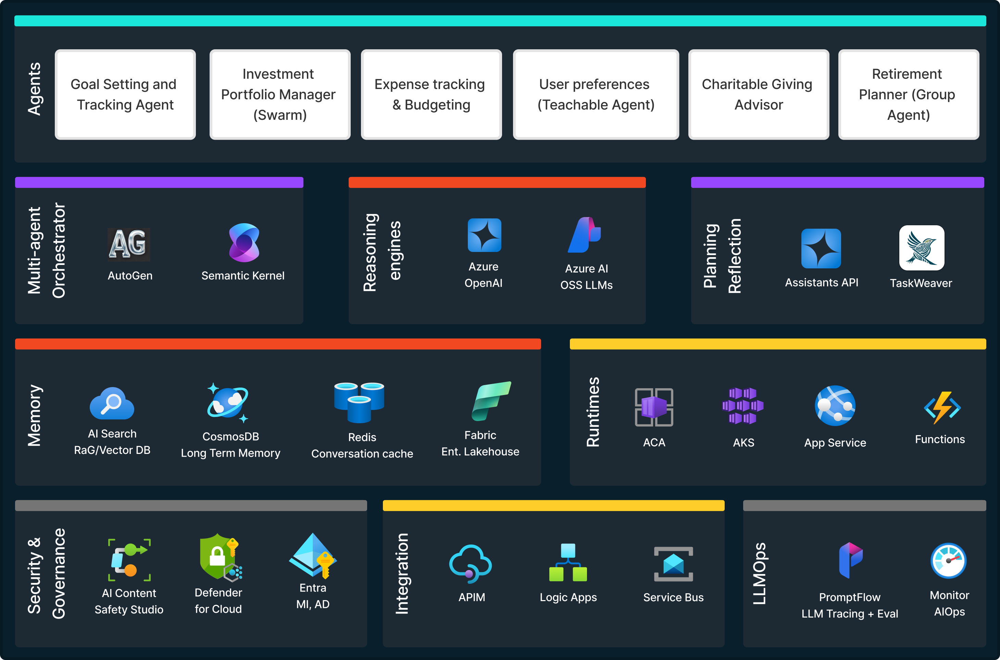

# Notebooks to showcase Agents and Assistants

This folder contains notebooks that demonstrate several use cases implemented using Azure OpenAI's Assistants API and Agent frameworks such as AutoGen, TaskWeaver, Semantic Kernel, and Langgraph. 

## Prerequisites

- An Azure subscription - [Create one for free](https://azure.microsoft.com/free/)
- An Azure OpenAI resource - [Create one](https://ms.portal.azure.com/#create/Microsoft.CognitiveServicesOpenAIAccount)
- Python 3.10 or later - [Install Python](https://www.python.org/downloads/)
- VS Code or Jupyter Notebook - [Install VS Code](https://code.visualstudio.com/download) | [Install Jupyter Notebook](https://jupyter.org/install)

## Setup

1. From Azure OpenAI, retrieve your model's name, and endpoint.
1. Ensure that the Managed Identity[^1] for your Azure OpenAI resource is properly configured and has the necessary roles assigned.
1. Set the `.env` file with the following environment variables:
    ```bash
    OPENAI_MODEL_NAME=<your-model-name>
    OPENAI_ENDPOINT=<your-endpoint>
    ```
1. Run the notebooks.

[^1]: > [!TIP]
> Using Managed Identity (MI) with Azure services enhances security by eliminating the need to manage API keys or other sensitive credentials in your code or configuration files. MI ensures an identity is managed by Azure and provides automatic authentication to Azure services. This reduces the risk of credential leakage and simplifies the management of permissions and access control.

## Architecture


## Notebooks

> WIP

### Agents with Assistants API
1. [Equity Analyst with Code Interpreter](./assistants-api/azure-openai/equity-analyst.ipynb)
1. [Analyst with Function calling using Logic Apps](./assistants-api/azure-openai/function-calling-ea.ipynb)

### Agents with AutoGen
1. [Retirement Planning](./autogen/notebooks/retirement-planning.ipynb)
1. [Expense tracking and budgeting](./autogen/notebooks/expense-tracking-budgeting.ipynb)


