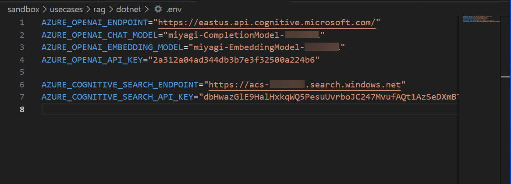

# Lab 1 - Run Miyagi Locally

In this lab, you'll setup and configure Miyagi app locally.

### Task 1: Setup configuration for miyagi app

1. Open **Visual Studio Code** from the Lab VM desktop by double-clicking on it.

   

   >**Note** If **Join us in making promt-flow extension better!** window prompted please click on **No,thanks**.

   
   
1. In **Visual Studio Code** from menu bar select **File(1)>open folder(2)**.

   

1. Within **File Explorer**, navigate to C:\LabFiles\miyagi select **miyagi**(1) click on **Select folder(2)**

   .png)

1. In **Visual Studio Code**, click on **Yes, I trust the authors** when **Do you trust the authors of the files in this folder?** window prompted.

   
   
1. Expand **miyagi>ui** directory and verify that **.env.** file is present. 

1. Expand **miyagi/services/recommendation-service/dotnet** directory and verify that **appsettings.json** is present.
  
1. Update appsettings.json with the values for the variables below. You can get the values from the Azure Portal.

1. To obtain the deployment model names for "deploymentOrModelId" and "embeddingDeploymentOrModelId" follow the below steps:
   
      - In Azure Portal, click on **Resource groups** from the Navigate panel.

      - From the Resource groups page, click on miyagi-rg-<inject key="DeploymentID" enableCopy="false"/>.

         

      - On **miyagi-rg-<inject key="DeploymentID" enableCopy="false"/>**, from the Overview (1) tab select the **OpenAIService-<inject key="DeploymentID" enableCopy="false"/> (2)**.

        

      - On the OpenAI Overview (1) page and right-click on Go to Azure OpenAI Studio (2) button and click on Open link a new tab.

          
   
      - In the Azure AI Studio, select Deployments, under Management section.
        

      - On the Deployments blade of Azure AI Studio, click on gpt-35-turbo model model name **(1)** and Copy full deployment name of gpt-35-turbo model **(2)** and enter copied deployment for 
        **"deploymentOrModelId"** in appsettings.json by navigating back to visual studio code.
          
        
          

          >**Note**: Kindly record deployment name of gpt-35-turbo model values in Notepad you need this values in further tasks.
      
      -  Navigate back to deployment page

      - On the Deployments blade of Azure AI Studio, click on **text-embedding-ada-002 model name (1)** and Copy full deployment name of **text-embedding-ada-002 model(2)** and enter copied deployment for 
        **"embeddingDeploymentOrModelId"** in appsettings.json by navigating back to visual studio code.   

         

         

      >**Note**: Kindly record the text-embedding-ada-002 model name in notepad you need this values in further tasks.

1. To obtain the values for **endpoint** and **apiKey** follow the below steps:

   -  Navigate back to the tab displaying **Azure portal**. 

   -  On **OpenAIService-<inject key="DeploymentID" enableCopy="false"/>** blade, under **Resource Management** section select **Keys and Endpoint**, copy the **KEY1** and **Endpoint** values in notepad and get back to Visual studio code in appsettings.json file paste **Key to **"<Your OpenAI API Key>"**, and "endpoints" to **"<Your Open AI point>"**,

      

       >**Note**: Kindly record the **KEY1** and **Endpoint** values in notepad you need this values in next further tasks.

1. To obtain the values for  "azureCognitiveSearchEndpoint", "azureCognitiveSearchApiKey", follow below steps:
   
   1. Navigate back to **miyagi-rg-<inject key="DeploymentID" enableCopy="false"/>** resource group.

   1. On the **miyagi-rg-<inject key="DeploymentID" enableCopy="false"/>** page, select **acs-<inject key="DeploymentID" enableCopy="false"/>** from resources list.
   
 
   1. On **acs-<inject key="DeploymentID" enableCopy="false"/>** blade copy the URL and get back to Visual studio code and paste URL to **azureCognitiveSearchEndpoint**
   

      >**Note**: Please record **URL** and paste in notepad you need this values in further tasks.

   1. On **acs-<inject key="DeploymentID" enableCopy="false"/>** blade, under **Settings** section, copy **Primary admin Key** values and paste to **azureCognitiveSearchApiKey** 
      in visual studio code
   
      

       >**Note**: Please record **Key** values in notepad you need this values in further tasks.

1. To obtain the values for "cosmosDbUri" and "cosmosDbName," please follow the steps below:

   1. Navigative back to resource group **miyagi-rg-<inject key="DeploymentID" enableCopy="false"/>** resource group page, select **cosmos-<inject key="DeploymentID" enableCopy="false"/>** from resources list.
      

   1. On **cosmos-<inject key="DeploymentID" enableCopy="false"/>** copy the URL 
      

      >**Note**: Please record **URL** in notepad you need this values in further tasks.

   1. On **cosmos-<inject key="DeploymentID" enableCopy="false"/>** under **Settings** select **Keys** and Copy the value of the **Cosmos DB Primary Connection String**.
      

       >**Note**: Please record **Cosmos DB Primary Connection String** in notepad you need this values in further tasks.

   1. Get back to visual studio and paste URL to **CosmosDBURI**, PRIMARY CONNECTION STRING to **Cosmos DB Connection String:** and  for **cosmosDbName** replace "miyagi** with **cosmos-<inject key="DeploymentID" enableCopy="false"/>**

        >**Note**: Please record **Name** values in notepad you need this values in further tasks.

1. For "blobServiceUri", replace Your **blobServiceUri** with https://miyagiblobstorge<inject key="DeploymentID" enableCopy="false"/>.blob.core.windows.net/

1. Leave default settings for  "cosmosDbContainerName": "recommendations","logLevel": "Trace"

1. Once afer updating the values kindly save the file by pressing **CTRL + S**.

1. Navigate to miyagi/sandbox/usecases/rag/dotnet and verify .env file is present
  
1. Update the values which you recorded in previous steps into .env file and save the file

   >**Note**: Please refer the below image to know how to update the values in .env files.

   

 ### Task 2: Setup .NET secrets

1. Navigate to **miyagi/services/recommendation-service/dotnet**, right click on dotnet and in cascading menu, select **Open in intergate Terminal**.
1. Run the following command to set the secrets for the recommendation service. You will need to provide the values for the variables below.
   
     ```
     dotnet user-secrets set "USE_OPEN_AI" "False"
     dotnet user-secrets set "serviceType" "AzureOpenAI"
     dotnet user-secrets set "BING_API_KEY" "<Your Bing API Key>"
     dotnet user-secrets set "MEMORY_COLLECTION" "miyagi-embeddings"
     dotnet user-secrets set "deploymentOrModelId" "<Your Open AI Completions model Deployment Id>"
     dotnet user-secrets set "embeddingDeploymentOrModelId" "<Your Open AI Embeddings model Deployment Id>"
     dotnet user-secrets set "endpoint" "<Your Open AI Endpoint>" 
     dotnet user-secrets set "apiKey" "<Your Open AI API Key>"
     dotnet user-secrets set "COSMOS_DB_CONNECTION_STRING" "<Cosmos DB Connection String>"    
     ```
   Use the following instructions to get the values for the arguments to the dotnet user-secrets set command

   -  **Bing API Key:** Provide **a6a11817493b4c2cb9a49d11bcd31e98**
   -  **deploymentOrModelId** Replace <Your Open AI Completions model Deployment Id> with deployment name for gpt-35-turbo model
   -  **embeddingDeploymentOrModelId** Replace  <Your Open AI Embeddings model Deployment Id> with deployment name for text-embedding-ada-002
   -  **Open AI Endpoint**: Replace "<Your Open AI Endpoint>" with Open AI Endpoint
   -  **Open AI API Key:** Replace "<Your Open AI API Key>" with Open AI Key
   -  **Cosmos DB Connection String:**  Replace "< Your Cosmos DB Connection String >" with the cosmos key

### Task 3: Understanding implementation of the recommendation service

Recommendation service implements RAG pattern using Semantic Kernel SDK. The details of the implementation are captured in the Jupyter notebook in the folder miyagi/sandbox/usecases/rag/dotnet. You can open the notebook in VSCode and run the cells to understand step by step details of how the Recommendation Service is implemented. Pay special attention to how RAG pattern is implemented using Semantic Kernel. Select kernel as .NET Interactive in the top right corner of the notebook.

1. In Visual Studio Code navigate to **miyagi/sandbox/usecases/rag/dotnet** folder and select **Getting-started.ipynb**

   

1. Execute the notebook cell by cell (using either Ctrl + Enter to stay on the same cell or Shift + Enter to advance to the next cell) and observe the results of each cell execution.
   
      **Note:** Please make sure that you are not running all the cells together as it can lead to exceeding the Azure OpenAI TPM limit and you may face an issue with 503 Service unreachable. You will need to wait for few minutes before running the cells again to fix the 503 issue.

   

 1. Once after Excuting all the cell you need see the output as shown in below diagram.

    
   
### Task 4: Run recommendation service locally

1. Open a new terminal: by navigating **miyagi/services/recommendation-service/dotnet** and right-click on in cascading menu select **Open in intergate Terminal**.

    

1. Run the following command to run the recommendation service locally
    ```
     dotnet build
     dotnet run
    ```

   **Note**: Let the command run, meanwhile you can proceed with the next step.

1. Open another tab in Edge, in the browser window paste the following link

   ```
     http://localhost:5224/swagger/index.html 
   ```

   **Note**: Refresh the page continuously until you get the swagger page for the recommendation service as depicted in the image below.

   


### Task 5: Run miyagi frontend locally

1. Open a new terminal: by navigating  **miyagi/ui** and right-click on **ui/typescript** , in cascading menu select **Open in intergate Terminal**.

   

1. Run the following command to install the dependencies
   
    ```
     npm install --global yarn
     yarn install
     yarn dev
    ```

   **Note**: Let the command run, meanwhile you can proceed with the next step.

1. Open another tab in Edge, and  browse the following

   ```
     http://localhost:4001
   ```

   **Note**: Refresh the page continuously until you get miyagi app running locally as depicted in the image below.
                       
   
   
### Task 6: Persist embeddings in Azure Cognitive Search

1. Navigate back to the **swagger UI** page, scoll to **Memory** session, click on **POST /dataset** for expansion, and click on **Try it out**.

   

1. Replace the code with the below code, and click on **Execution**.
   
     >**Note:** Please make sure that you are not clicking multiple times on the Execute button as it can lead to exceeding the Azure OpenAI TPM limit and you may face an issue with 503 Service unreachable. You will need to wait for a few minutes before executing it again to fix the 503 issue.
   
      ```
        {
        "metadata": {
            "userId": "50",
            "riskLevel": "aggressive",
            "favoriteSubReddit": "finance",
            "favoriteAdvisor": "Jim Cramer"
        },
        "dataSetName": "intelligent-investor"
        }
      ```

      
      
1. In the **swagger UI** page, Scroll down to the **Responses** session review that it has been executed successfully by checking the code status is **200**.

    

1. Navigate back to the **Azure portal** tab, search and select **Cognitive Search**.

        

1. In **Azure AI services | Cognitive search** tab, select **acs-<inject key="DeploymentID" enableCopy="false"/>**.

1. In **acs-<inject key="DeploymentID" enableCopy="false"/>** Search service tab, click on **Indexes** **(1)** under Search management, and review the **miyagi-embeddings** **(2)** has been created.   

    

    > **Note**: Please click on the refresh button still you view the **Document Count**.

### Task 7: Explore the recommendation service

1. Navigate back to the **recommendation service** ui page, and click on **personalize** button.

    

1. In the **personalize** page, select your **financial advisor** from the drop-down, and click on **Personalize**.

     

1. You should see the recommendations from the recommendation service in the Top Stocks widget.

    
