# Lab 2.1: Containerizing Miyagi UI and Recommendation service to Azure Container Apps

In this lab, you'll be building the docker images and publishing them to Azure Container Apps.

### Task 1: Build a Docker Image for the Miyagi UI

1. Open the **Docker** Application from the Lab VM desktop by double-clicking on it.

   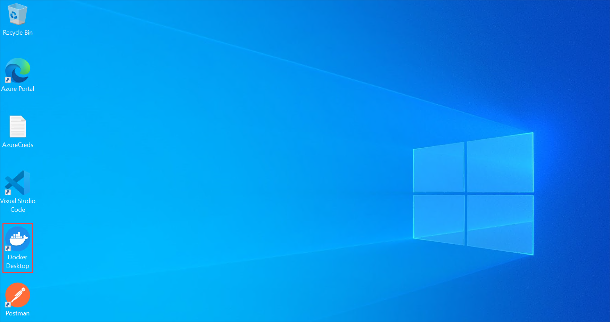
   
1. In the **Docker Subscription Service Agreement** window, click **Accept**.

   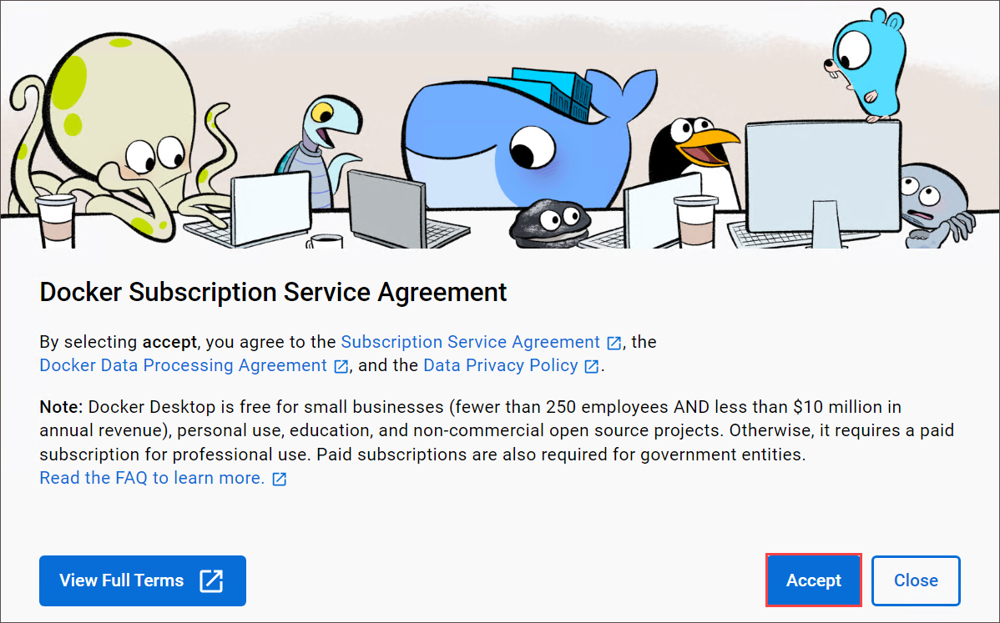

1. In the **Welcome to Docker Desktop** window, click on **Continue without signing in**.

   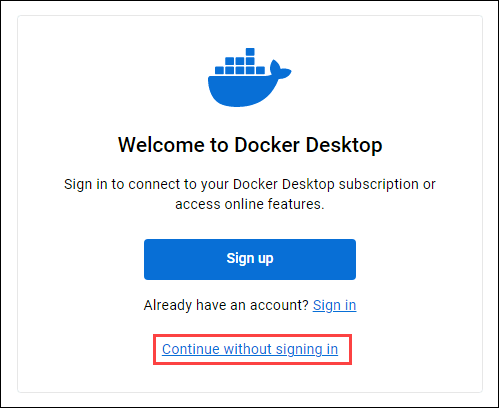

1. In the **Tell us about the work you do** window, click on **Skip**.
   
1. Navigate back to **Visual studio code** window and navigate to **miyagi/ui/typescript** right - click on dotnet in cascading menu, select **Open in integrate Terminal**.

   ```
   docker build . -t miyagi-ui      
   ```

   > **Note**: Please wait as this command may require some time to complete.

1. Run the following command to get the newly created image.

   ```
   docker images
   ```
1. Navigate back to **Docker desktop**, from the left pane select **Images**.

   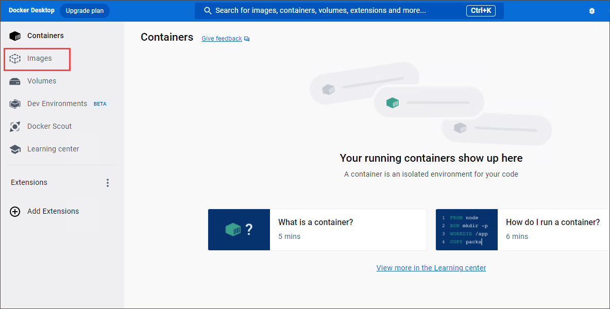

1. In the **Images** blade, notice **miyagi-ui(1)** image is created, select **run(2)** icon .

   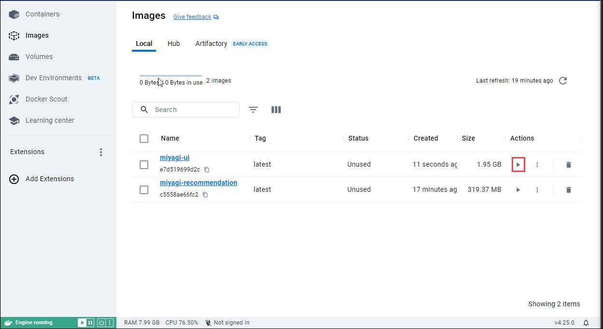

1. In the **Run a new container** window select the dropdown arrow.

   .png)

1. In the **Run a new containe**, under **Ports** for **Host Port** enter **3000** and click on **Run**.

    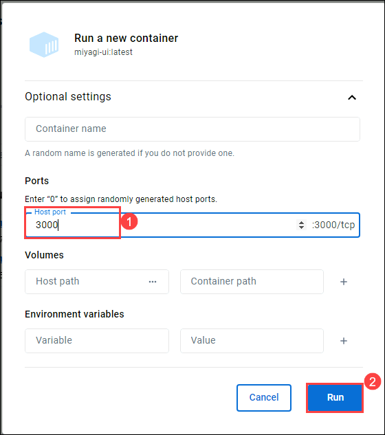

1. Click on **3000:3000** URL link

   
   
1. You should be able to see the application running locally
   
   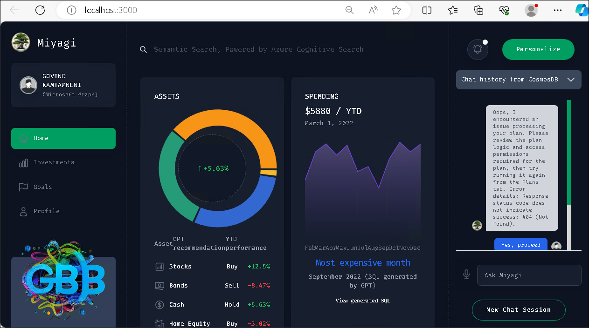

### Task 2: Build Docker Images for the Recommendation service

1. Navigate back to **Visual studio code** window and navigate to **miyagi/services/recommendation-service/dotnet** right - click on dotnet in cascading menu, select **Open in integrate Terminal**.

1. Run the following command to build a **Docker image**

   ```
   docker build . -t miyagi-recommendation      
   ```

   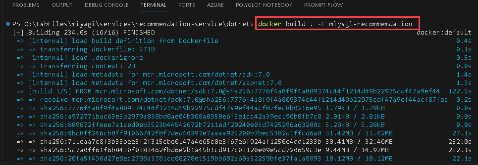

   > **Note**: Please wait as this command may require some time to complete.

1. Run the following command to get the newly created image.

   ```
   docker images
   ```
   
   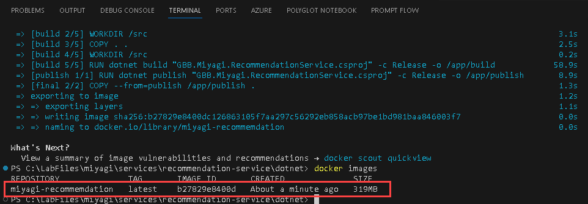

1. Navigate back to **Docker desktop**, from the left pane select **Images**.

   

1. In the **Images** blade, notice **miyagi-recommendation(1)** image is created, select **run(2)** icon .

   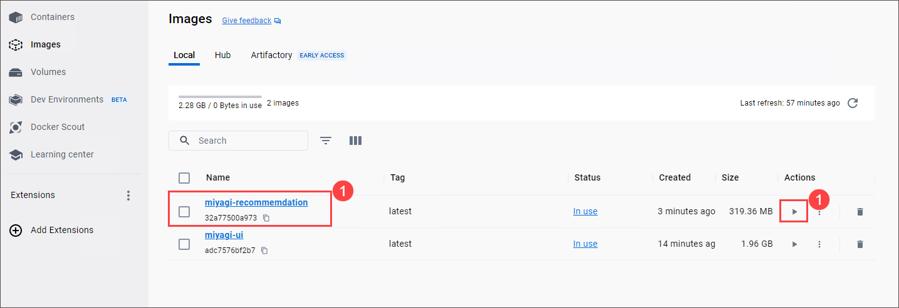

1. In the **Run a new container** window select the dropdown arrow.

   .png)

1. In the **Run a new containe**, under **Ports** for **Host Port** enter **5224** and click on **Run**.

    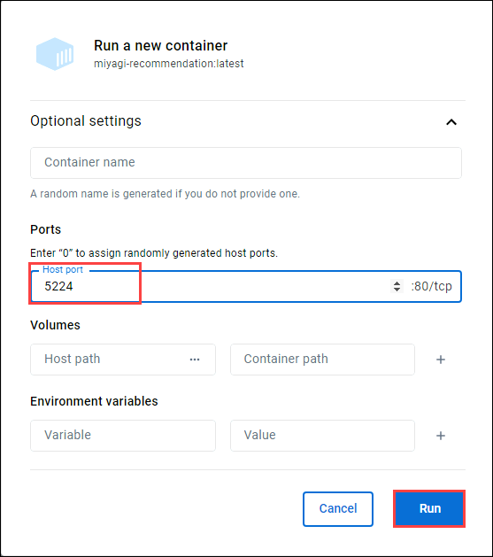

1. Click on **5224:80** URL link

   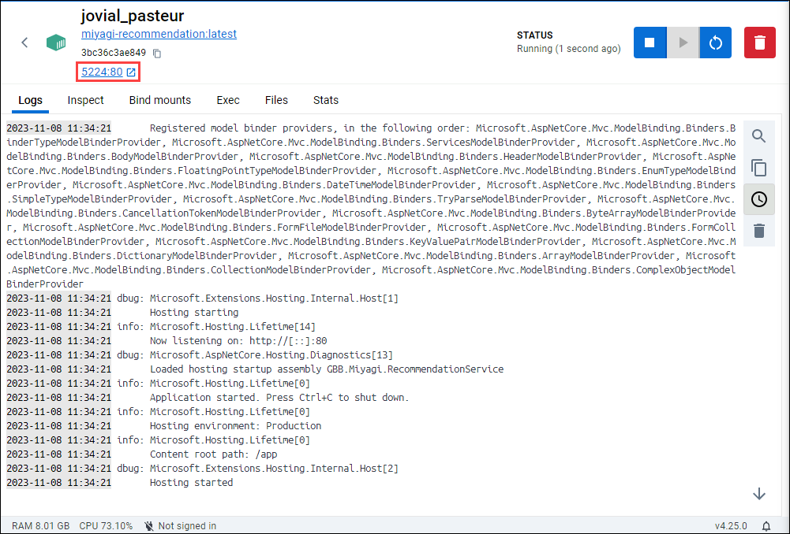
   
1. You should be able to see the application running locally
   
   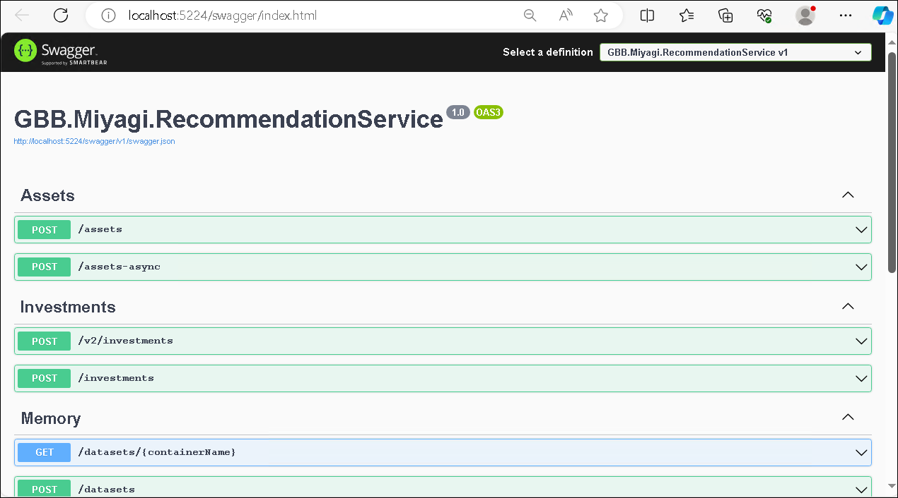

### Task 3: Push the Docker Image of Recommendation service to Container registry

In this task, you'll Push miyagi-recommendation images to acr. 

1. Navigate back to the **Visual studio code** window and navigate to **miyagi/services/recommendation-service/dotnet** right - click on dotnet in cascading menu, select **Open in integrate Terminal**

1. Run the following command to log in to the **Azure portal**.

    ```
    az login
    ```

1. This will redirect to **Microsoft login page**, select your Azure account **<inject key="AzureAdUserEmail"></inject>**, and navigate back to the **Visual studio code**.

   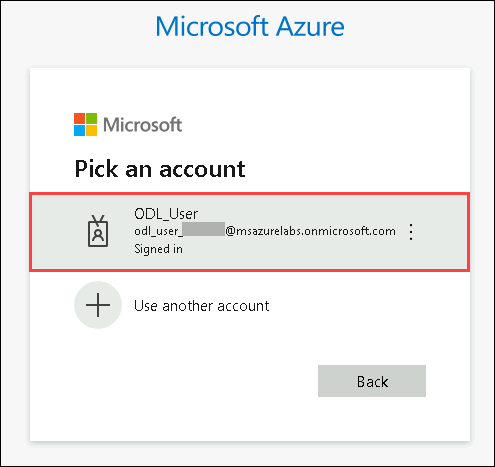

1. Run the following command to log in to an **Azure Container Registry (ACR)** using the Azure CLI.

   > **Note**: Please replace **[ACRname]** and **[uname]** with **<inject key="AcrUsername" enableCopy="true"/>**, and **[password]** with **<inject key="AcrPassword" enableCopy="true"/>**.
   
   ```
   az acr login -n [ACRname] -u [uname] -p [password]
   ```

   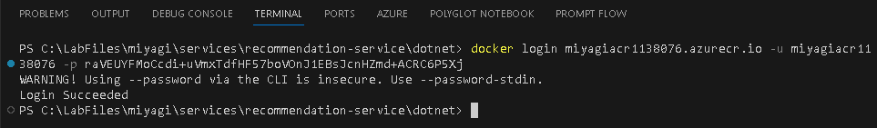
    
1. Run the following command to add the tag.

   > **Note**: Please replace **[ACRname]** with **<inject key="AcrLoginServer" enableCopy="true"/>**.

   ```
   docker tag miyagi-recommendation:latest [ACRname]/miyagi-recommendation:latest
   ```

1. Run the following command to push the image to the container registry.

   > **Note**: Please replace **[ACRname]** with **<inject key="AcrLoginServer" enableCopy="true"/>**.

   ```
   docker push [ACRname]/miyagi-recommendation:latest
   ```

   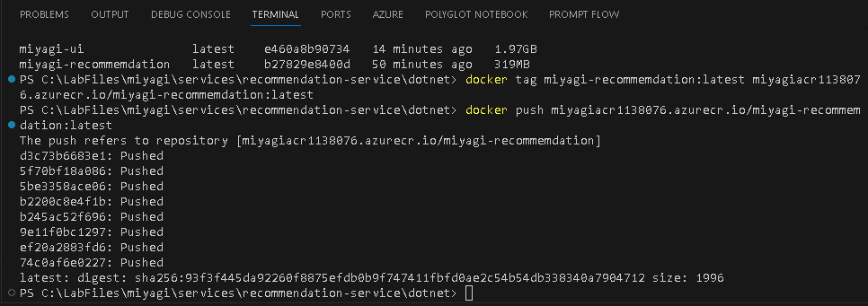

### Task 4: Create a container app for miyagi-recommendation

In this task, you'll will be creating a container app for the recommendation.

1. Run the following command to create **Container App environment**.

   > **Note**: Please replace **[DID]** with **<inject key="DeploymentID" enableCopy="true"/>** and **[Region]** with **<inject key="Region" enableCopy="true"/>**.

   ```
   az containerapp env create --name env-miyagi-[DID] --resource-group miyagi-rg-[DID] --location [Region]
   ```

1. Run the following command to create **Container App**.

   > **Note**: Please replace **[DID]** with **<inject key="DeploymentID" enableCopy="true"/>**, **[ACRname]** with **<inject key="AcrLoginServer" enableCopy="true"/>**, **[uname]** with **<inject key="AcrUsername" enableCopy="true"/>**, and **[password]** with **<inject key="AcrPassword" enableCopy="true"/>**.

   ```
   az containerapp create --name ca-miyagi-rec-[DID] --resource-group miyagi-rg-[DID] --image [ACRname]/miyagi-recommendation:latest --environment env-miyagi-[DID] --registry-server [ACRname] --registry-username [uname] --registry-password [password]
   ```

1. Run the following command to enable **Container App ingress**.

   > **Note**: Please replace **[DID]** with **<inject key="DeploymentID" enableCopy="true"/>**
   
   ```
   az containerapp ingress enable -n ca-miyagi-rec-[DID] -g miyagi-rg-[DID] --type external --allow-insecure --target-port 80
   ```
 
### Task 5: Update Container App Recommendation service URL for miyagi-ui

1. In the Azure Portal page, in the Search resources, services, and docs (G+/) box at the top of the portal, enter **Container Apps (1)**, and then select **Container Apps (2)** under services.

   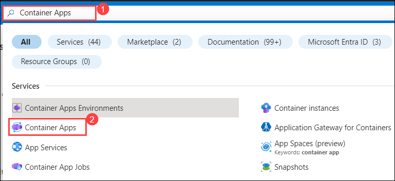

1. In the **Container Apps** blade, select **ca-miyagi-rec-<inject key="DeploymentID" enableCopy="false"/>**.

   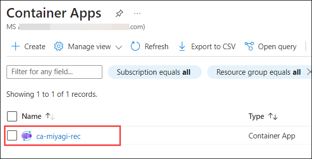

1. In the **ca-miyagi-rec-<inject key="DeploymentID" enableCopy="false"/>** page, from left navigation pane select **Ingress** **(1)** under setting session and copy **Endpoints** **(2)** URL link.

   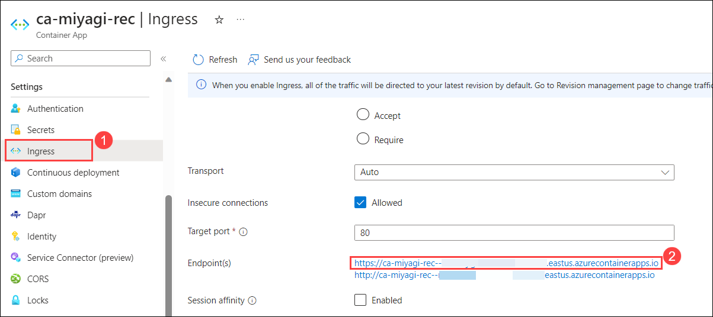

1. Navigate back to **Visual Studio Code**, navigate to **miyagi>ui>typescript>.env.** and replace existing code for **NEXT_PUBLIC_RECCOMMENDATION_SERVICE_URL** with copied for **Endpoints** and save the file 

   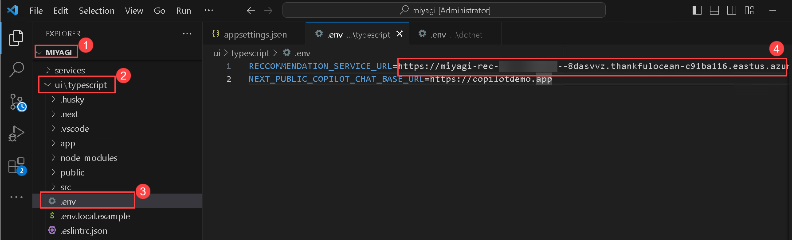

1. Right-click on **ui/typescript** in cascading menu, select **Open in intergate Terminal**.

1. Run the following command to log in.

   > **Note**: Please replace **[ACRname]** with **<inject key="AcrLoginServer" enableCopy="true"/>**, **[uname]** with **<inject key="AcrUsername" enableCopy="true"/>**, and **[password]** with **<inject key="AcrPassword" enableCopy="true"/>**.

    ```
    az acr login -n [ACRname] -u [uname] -p [password]
    ```
   
1. Run the following command to re-build the docker image.

   ```
   docker build . -t miyagi-ui:latest
   ```

1. Run the following command to add the tag.

   > **Note**: Please replace **[ACRname]** with **<inject key="AcrLoginServer" enableCopy="true"/>**.

   ```
   docker tag miyagi-ui:latest [ACRname]/miyagi-ui:latest
   ```

1. Run the following command to push the image to the container registry

   > **Note**: Please replace **[ACRname]** with **<inject key="AcrLoginServer" enableCopy="true"/>**.

   ```
   docker push [ACRname]/miyagi-ui:latest
   ```

### Task 6: Create a container app for miyagi-ui

In this task, you'll will be creating a container app for the UI.

1. Run the following command to create **Container App**.

   > **Note**: Please replace **[DID]** with **<inject key="DeploymentID" enableCopy="true"/>**, **[ACRname]** with **<inject key="AcrLoginServer" enableCopy="true"/>**, **[uname]** with **<inject key="AcrUsername" enableCopy="true"/>**, and **[password]** with **<inject key="AcrPassword" enableCopy="true"/>**.

   ```
   az containerapp create --name ca-miyagi-ui-[DID] --resource-group miyagi-rg-[DID] --image [ACRname]/miyagi-ui:latest --environment env-miyagi-[DID] --registry-server [ACRname] --registry-username [uname] --registry-password [password]
   ```

1. Run the following command to enable **Container App ingress**.

   > **Note**: Please replace **[DID]** with **<inject key="DeploymentID" enableCopy="true"/>**
   
   ```
   az containerapp ingress enable -n ca-miyagi-ui-[DID] -g miyagi-rg-[DID] --type external --allow-insecure --target-port 80
   ```

# Lab 2.2: Explore and Verify the Containerized Miyagi UI and Recommendation service in Azure Container Apps

### Task 1: Explore Recommendation service in Azure Container Apps using Ingress Endpoint

1. In the Azure Portal page, in the Search resources, services, and docs (G+/) box at the top of the portal, enter **Container Apps (1)**, and then select **Container Apps (2)** under services.

   

1. In the **Container Apps** blade, select **ca-miyagi-rec-<inject key="DeploymentID" enableCopy="false"/>**.

   

1. In the **ca-miyagi-rec-<inject key="DeploymentID" enableCopy="false"/>** page, from left navigation pane select **Ingress** **(1)** under setting session and click on **Endpoints** **(2)** URL link.

   

1. You can view the **miyagi Recommendation service** website running through the Container Apps.

   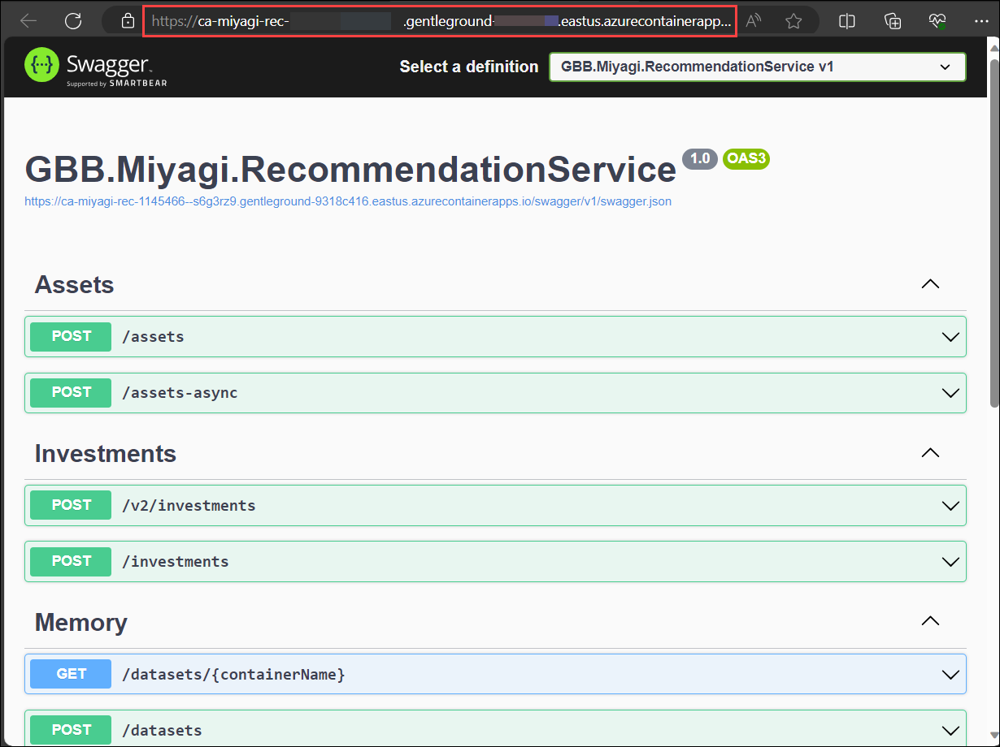    

### Task 2: Explore Miyagi App in Azure Container Apps using Ingress Endpoint

1. Return to **Azure Portal** in Search resources, services box at the top of the portal, enter **Container Apps**, and then select **Container Apps** under services.

1. In the **Container Apps** blade, select **ca-miyagi-ui-<inject key="DeploymentID" enableCopy="false"/>**.

   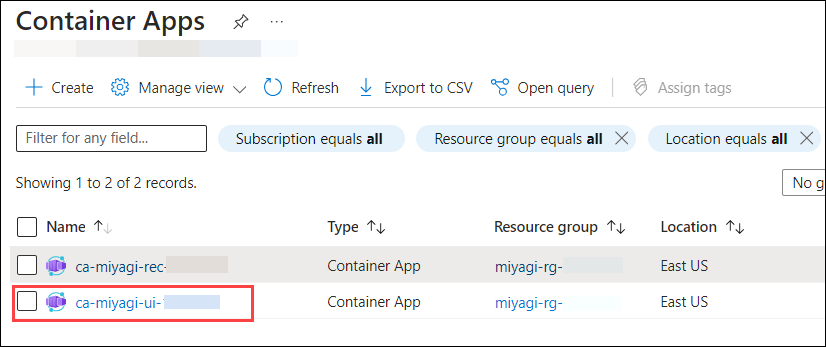

1. In the **ca-miyagi-ui-<inject key="DeploymentID" enableCopy="false"/>**, from left navigation pane select **Ingress** under setting and click on **Endpoints** URL link.

   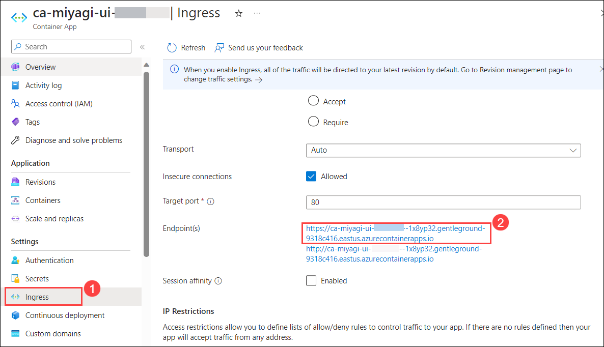

1. You can view the **miyagi app** running through the Container Apps.

      

