# Lab 1 - Run Miyagi Locally

In this lab, you'll setup and configure Miyagi app locally.

### Task 1: Setup configuration for miyagi app

1. Open **Visual Studio Code** from the Lab VM desktop by double-clicking on it.

   

   >**Note** If **Join us in making promt-flow extension better!** window prompted please click on **No,thanks**.

   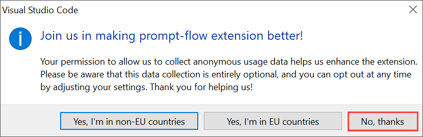
   
1. In **Visual Studio Code** from menu bar select **File(1)>open folder(2)**.

   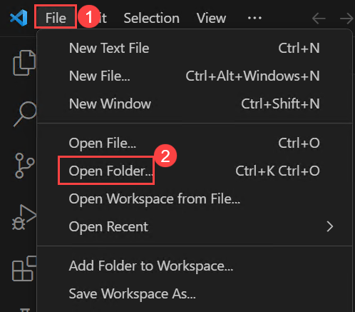

1. Within **File Explorer**, navigate to **C:\LabFiles\miyagi** select **miyagi**(1) click on **Select folder(2)**

   .png)

1. In **Visual Studio Code**, click on **Yes, I trust the authors** when **Do you trust the authors of the files in this folder?** window prompted.

   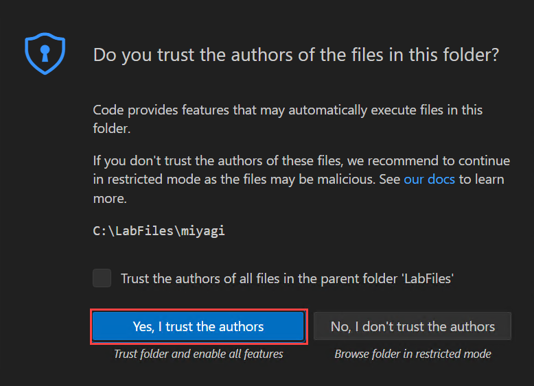 
   
1. Expand **miyagi>ui** directory and verify that **.env.** file is present. 

1. Expand **miyagi/services/recommendation-service/dotnet** directory and verify that **appsettings.json** file is present.
  
1. In the **appsettings.json** file replace the following values for the variables below.

   | **Variables**                | **Values**                                                    |
   | ---------------------------- |---------------------------------------------------------------|
   | deploymentOrModelId          | **<inject key="CompletionModel" enableCopy="true"/>**         |
   | embeddingDeploymentOrModelId | **<inject key="EmbeddingModel" enableCopy="true"/>**          |
   | endpoint                     | **<inject key="OpenAIEndpoint" enableCopy="true"/>**          |
   | apiKey                       | **<inject key="OpenAIKey" enableCopy="true"/>**               |
   | azureCognitiveSearchEndpoint | **<inject key="SearchServiceuri" enableCopy="true"/>**        |
   | azureCognitiveSearchApiKey   | **<inject key="SearchAPIkey" enableCopy="true"/>**            |
   | cosmosDbUri                  | **<inject key="CosmosDBuri" enableCopy="true"/>**             |
   | blobServiceUri               | **<inject key="StorageAccounturi" enableCopy="true"/>**       |
   | bingApiKey                   | **<inject key="Bing_API_KEY" enableCopy="true"/>**           |
   | cosmosDbConnectionString     | **<inject key="CosmosDBconnectinString" enableCopy="true"/>** |
   
   > **Note**: Leave default settings for "cosmosDbContainerName": "recommendations", "logLevel": "Trace"

      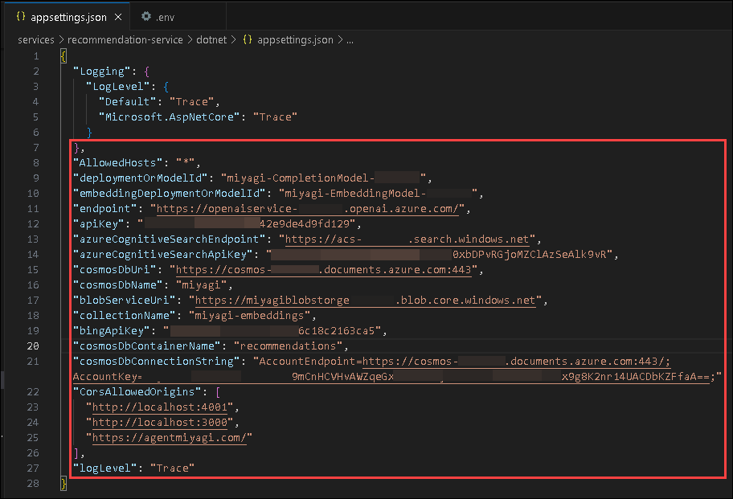
   
1. Once after updating the values kindly save the file by pressing **CTRL + S**.

1. Navigate to **miyagi/sandbox/usecases/rag/dotnet** and verify **.env** file is present.
  
1. In the **.env** file replace the following values for the variables below.

   | **Variables**                          | **Values**                                            |
   | ---------------------------------------| ------------------------------------------------------|
   | AZURE_OPENAI_ENDPOINT **(1)**          | **<inject key="OpenAIEndpoint" enableCopy="true"/>**  |
   | AZURE_OPENAI_API_KEY  **(2)**          | **<inject key="OpenAIKey" enableCopy="true"/>**       |
   | AZURE_COGNITIVE_SEARCH_ENDPOINT **(3)**| **<inject key="SearchServiceuri" enableCopy="true"/>**|
   |AZURE_COGNITIVE_SEARCH_API_KEY **(4)**  | **<inject key="SearchAPIkey" enableCopy="true"/>**    |
   
   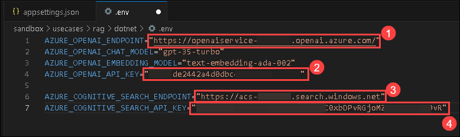

 ### Task 2: Setup .NET secrets

1. Navigate to **miyagi/services/recommendation-service/dotnet**, right click on dotnet and in cascading menu, select **Open in intergate Terminal**.

1. Run the following command to set the secrets for the recommendation service. You will need to provide the values for the variables below.
   
     ```
     dotnet user-secrets set "USE_OPEN_AI" "False"
     dotnet user-secrets set "serviceType" "AzureOpenAI"
     dotnet user-secrets set "BING_API_KEY" "<inject key="Bing_API_KEY" enableCopy="false"/>"
     dotnet user-secrets set "MEMORY_COLLECTION" "miyagi-embeddings"
     dotnet user-secrets set "deploymentOrModelId" "<inject key="CompletionModel" enableCopy="false"/>"
     dotnet user-secrets set "embeddingDeploymentOrModelId" "<inject key="EmbeddingModel" enableCopy="false"/>"
     dotnet user-secrets set "endpoint" "<inject key="OpenAIEndpoint" enableCopy="false"/>" 
     dotnet user-secrets set "apiKey" "<inject key="OpenAIKey" enableCopy="false"/>"
     dotnet user-secrets set "COSMOS_DB_CONNECTION_STRING" "<inject key="CosmosDBconnectinString" enableCopy="false"/>"  
     ```

### Task 3: Understanding the implementation of the recommendation service

Recommendation service implements RAG pattern using Semantic Kernel SDK. The details of the implementation are captured in the Jupyter notebook in the folder miyagi/sandbox/usecases/rag/dotnet. You can open the notebook in VSCode and run the cells to understand step-by-step details of how the Recommendation Service is implemented. Pay special attention to how the RAG pattern is implemented using Semantic Kernel. Select kernel as .NET Interactive in the top right corner of the notebook.

1. In Visual Studio Code navigate to **miyagi/sandbox/usecases/rag/dotnet** folder and select **Getting-started.ipynb**

   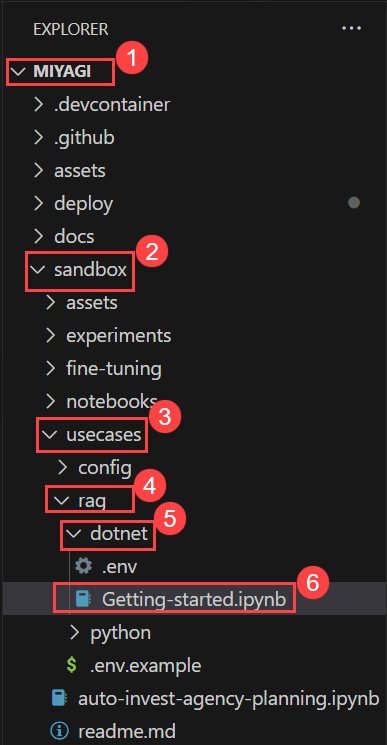

1. Execute the notebook cell by cell (using either Ctrl + Enter to stay on the same cell or Shift + Enter to advance to the next cell) and observe the results of each cell execution.

   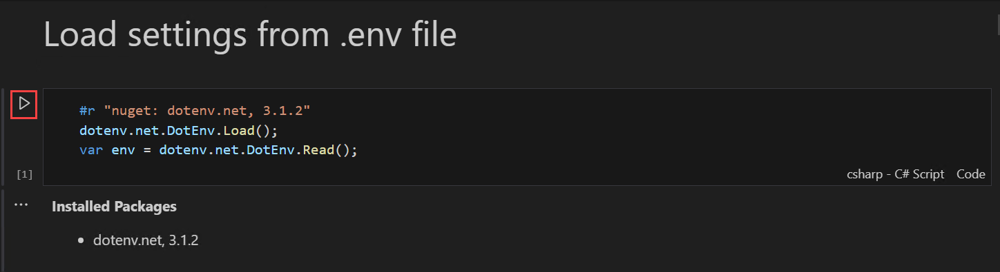

 1. Once after Executing all the cells you need to see the output as shown in the below diagram.

    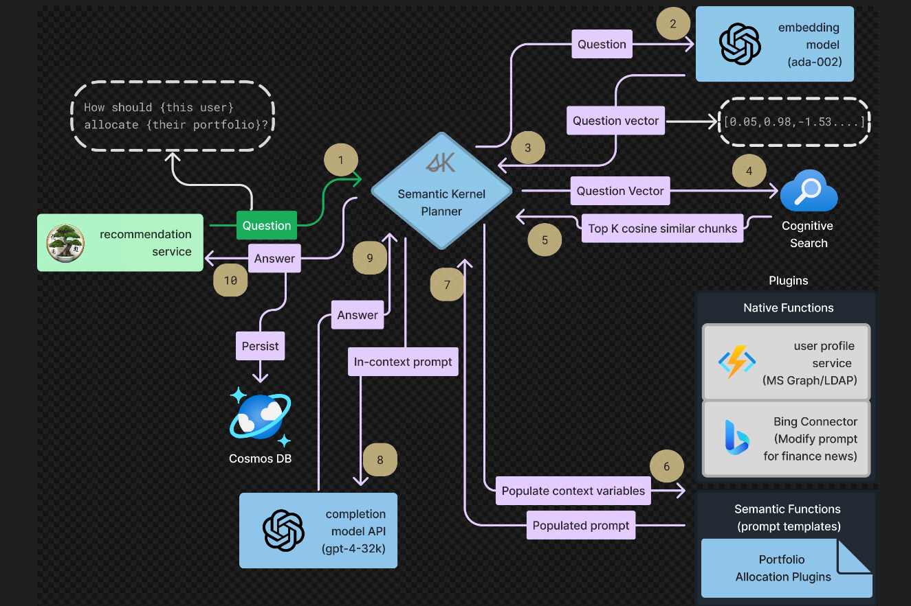
   
### Task 4: Run recommendation service locally

1. Open a new terminal: by navigating **miyagi/services/recommendation-service/dotnet** and right-click on in cascading menu select **Open in intergate Terminal**.

    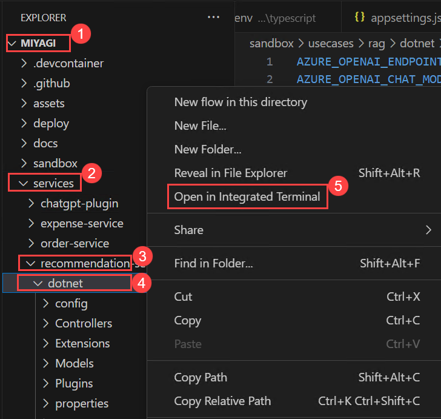

1. Run the following command to run the recommendation service locally
    ```
    dotnet build
    dotnet run
    ```

   **Note**: Let the command run, meanwhile you can proceed with the next step.

1. Open another tab in Edge, in the browser window paste the following link

   ```
   http://localhost:5224/swagger/index.html 
   ```

   **Note**: Refresh the page continuously until you get the swagger page for the recommendation service as depicted in the image below.

   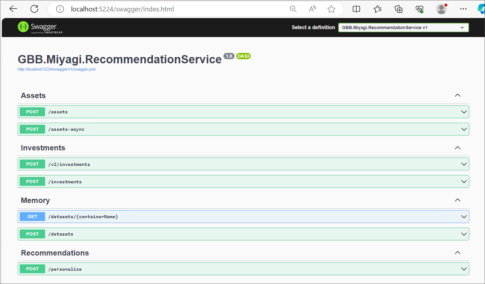


### Task 5: Run miyagi frontend locally

1. Open a new terminal: by navigating  **miyagi/ui** and right-click on **ui/typescript** , in cascading menu select **Open in intergate Terminal**.

   

1. Run the following command to install the dependencies
   
    ```
    npm install --global yarn
    yarn install
    yarn dev
    ```

   **Note**: Let the command run, meanwhile you can proceed with the next step.

1. Open another tab in Edge, and  browse the following

   ```
   http://localhost:4001
   ```

   **Note**: Refresh the page continuously until you get miyagi app running locally as depicted in the image below.
                       
   
   
### Task 6: Persist embeddings in Azure AI Search

1. Navigate back to the **swagger UI** page, scoll to **Memory** session, click on **POST /dataset** for expansion, and click on **Try it out**.

   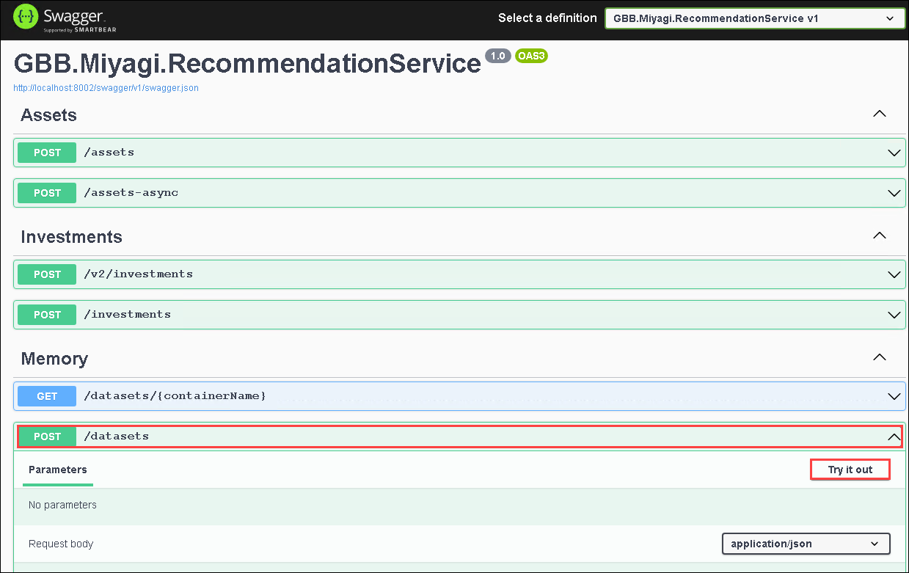

1. Replace the code with the below code, and click on **Execution**.

     ```
     {
        "metadata": {
              "userId": "50",
              "riskLevel": "aggressive",
              "favoriteSubReddit": "finance",
              "favoriteAdvisor": "Jim Cramer"
            },
          "dataSetName": "intelligent-investor"
      }
      ```

      
      
1. In the **swagger UI** page, Scroll down to the **Responses** session review that it has been executed successfully by checking the code status is **200**.

    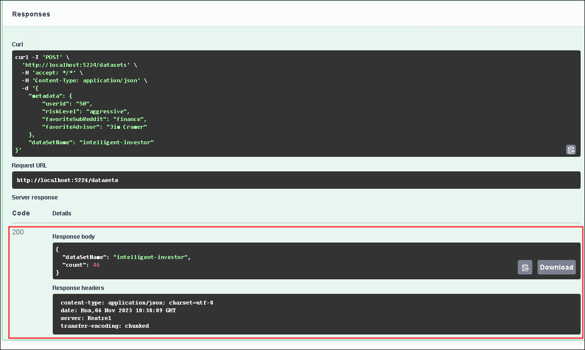

1. Navigate back to the **Azure portal** tab, search and select **AI Search**.

    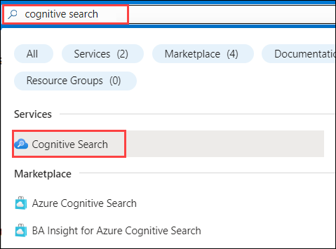    

1. In **Azure AI services | AI Search** tab, select **acs-<inject key="DeploymentID" enableCopy="false"/>**.

1. In **acs-<inject key="DeploymentID" enableCopy="false"/>** Search service tab, click on **Indexes** **(1)** under Search management, and review the **miyagi-embeddings** **(2)** has been created.   

    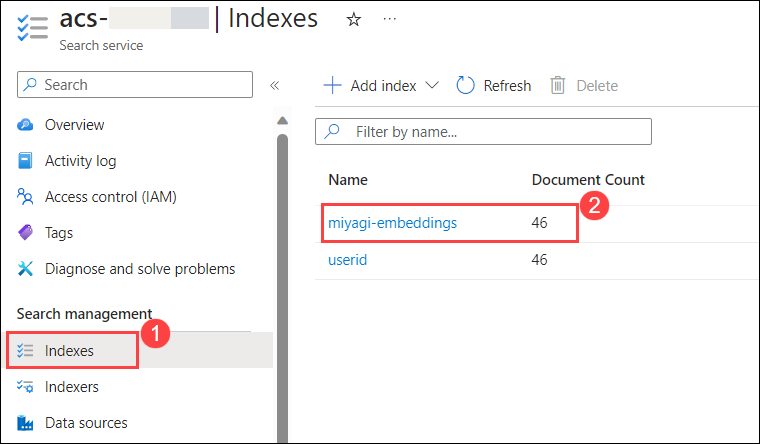

    > **Note**: Please click on the refresh button still you view the **Document Count**.

### Task 7: Explore the recommendation service

1. Navigate back to the **recommendation service** ui page, and click on **personalize** button.

    

1. In the **personalize** page, select your **financial advisor** from the drop-down, and click on **Personalize**.

     

1. You should see the recommendations from the recommendation service in the Top Stocks widget.

    

1. Now, click on **Next** from the lower right corner to move to the next page.
