# Lab 2.2: Explore and Verify the Containerized Recommendation service in Azure Container App using Local Miyagi UI

### Duration: 40 minutes

In this Lab, you'll be exploring and verifying the automated Containerized Recommendation service in Azure Container App. 
 
### Task 1: Verify the Recommendation service running in the Container App by Personalizing

1. In the Azure Portal page, in the Search resources, services, and docs (G+/) box at the top of the portal, enter **Container Apps (1)**, and then select **Container Apps (2)** under services.

   

1. In the **Container Apps** blade, select **ca-miyagi-rec-<inject key="DeploymentID" enableCopy="false"/>**.

   

1. In the **ca-miyagi-rec-<inject key="DeploymentID" enableCopy="false"/>** page, from the left navigation pane select **Ingress** **(1)** under setting session and click on **Endpoints** **(2)** URL link.

   

1. Navigate back to container app **ca-miyagi-rec-<inject key="DeploymentID" enableCopy="false"/>**, and click on **Log Stream** under **Monitoring** from the left menu.

    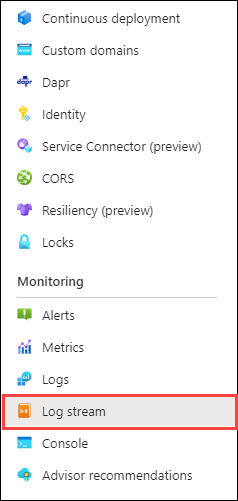
   
      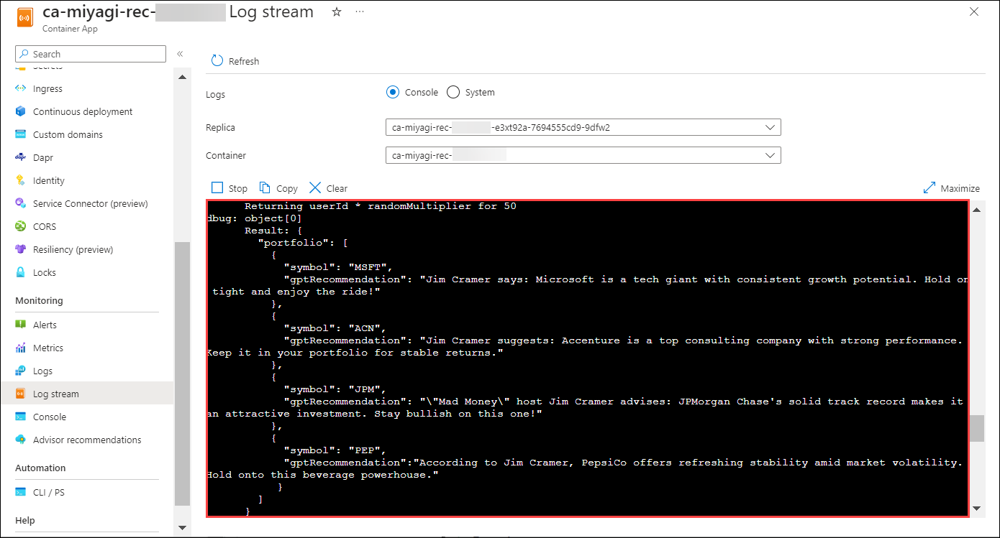
   
     > **Note** : Please click on **Refresh** for the logs to show up .

1. Navigate back to **Miyagi Recommendations** page, scroll down to the **Recommendations**, click on **POST /personalize** expansion, and click on **Try it out**.

   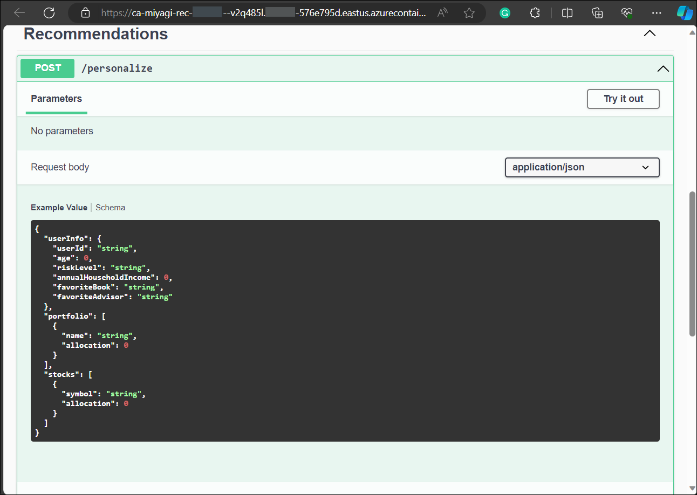

1. Replace the provided **JSON code** below and click on **Execute**.

   ```
   {
       "userInfo": {
       "userId": "50",
       "riskLevel": "aggressive",
       "favoriteSubReddit": "finance",
       "favoriteAdvisor": "Jim Cramer"
       },
       "portfolio": [
           {
               "name": "Stocks",
               "allocation": 0.5
           },
           {
               "name": "Bonds",
               "allocation": 0.3
            },
            {
                    "name": "Cash",
                    "allocation": 0.1
            },
            {
                    "name": "HomeEquity",
                    "allocation": 0.1
            }
          ],
          "stocks": [
            {
                    "symbol": "MSFT",
                    "allocation": 0.3
            },
            {
                    "symbol": "ACN",
                    "allocation": 0.1
            },
            {
                    "symbol": "JPM",
                    "allocation": 0.3
            },
            {
                    "symbol": "PEP",
                    "allocation": 0.3
            }
       ]
   }
   ```

      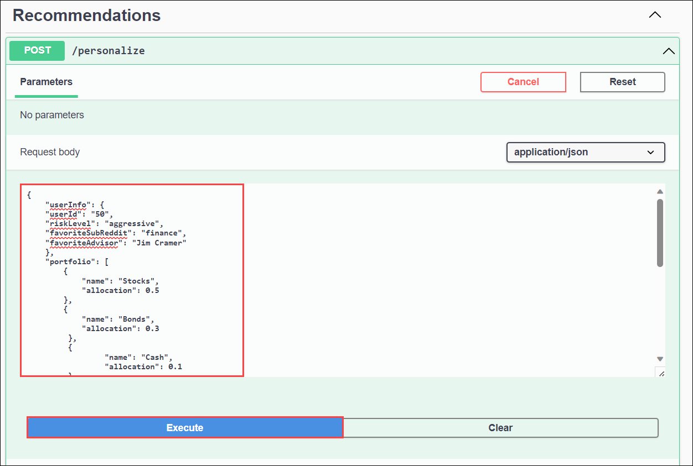

1. In the **Miyagi Recommendations** page, Scroll down to the Responses session review that it has been executed successfully by checking the code status is **200**, and review the **Response body** section.

   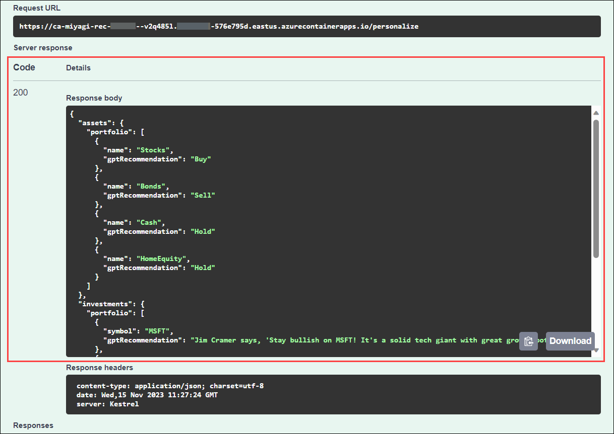

1. Navigate back to container app **ca-miyagi-rec-<inject key="DeploymentID" enableCopy="false"/>|Log stream**, review the **logs**.

### Task 2: Update Container App Recommendation service URL for Miyagi UI

1. Once you completed the review of the logs, click on **Ingress** **(1)** under **Settings** and copy **Endpoints** **(2)** URL link.

   

1. Navigate back to **Visual Studio Code**, navigate to **miyagi>ui>typescript>.env.** and replace existing code for **NEXT_PUBLIC_RECCOMMENDATION_SERVICE_URL** with copied for **Endpoints** and save the file 

   

### Task 3: Access Recommendation Service running on Azure Container Apps from Local Miyagi-UI 

1. Open a new terminal: by navigating  **miyagi/ui** and right-click on **ui/typescript** , in cascading menu select **Open in intergate Terminal**.

   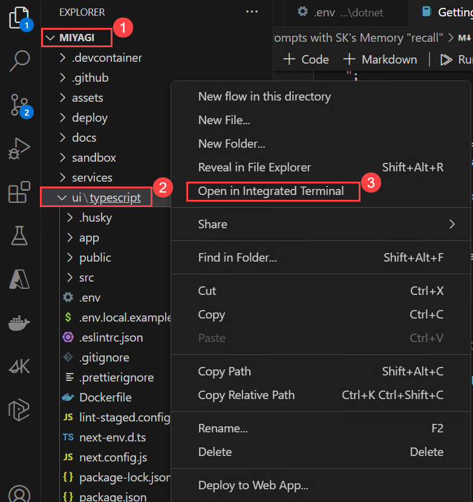

1. Run the following command to install the dependencies
   
    ```
    yarn dev
    ```

   **Note**: Let the command run, meanwhile you can proceed with the next step.

1. Open another tab in Edge, and  browse the following

   ```
   http://localhost:4001
   ```

    > **Note**: Refresh the page continuously until you get miyagi app running locally as depicted in the image below.
                       
   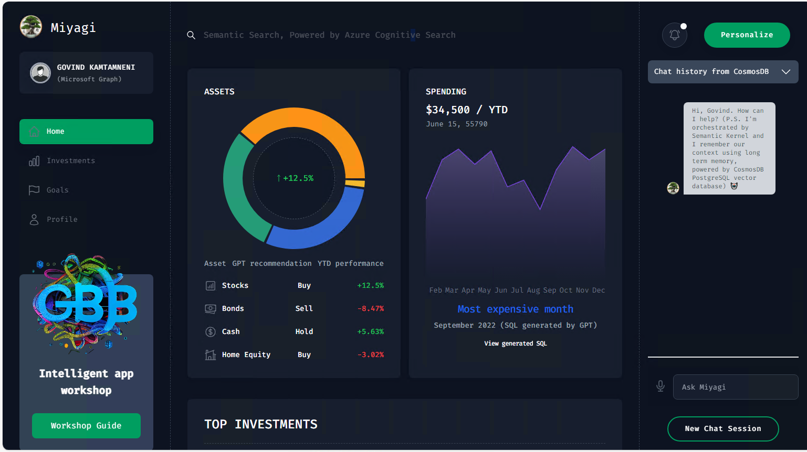

1. In the to the **recommendation service** ui page, and click on **personalize** button.

    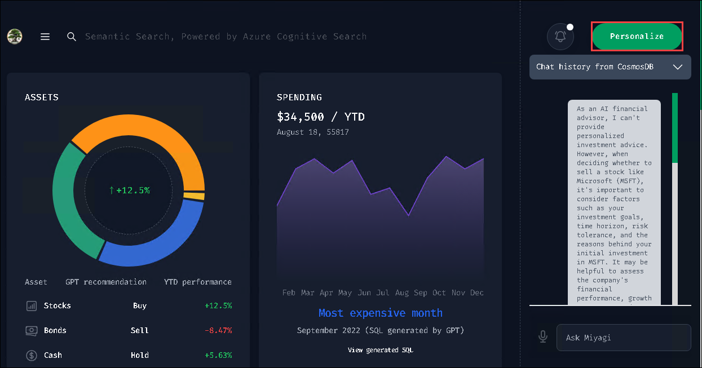

1. In the **personalize** page, select your **financial advisor** from the drop-down, and click on **Personalize**.

   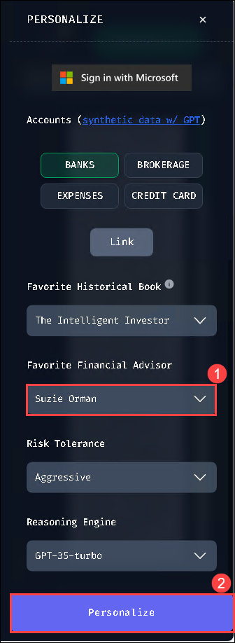  

1. You should see the recommendations from the recommendation service in the Top Stocks widget.

   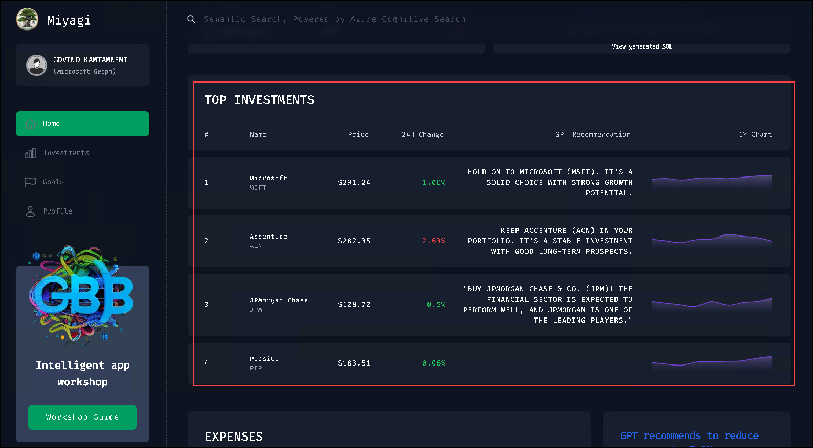

1. Navigate back to the **ca-miyagi-rec-<inject key="DeploymentID" enableCopy="false"/>** Container App, from the left-side menu select **Log stream** under Monitoring, and you can go through the logs.

    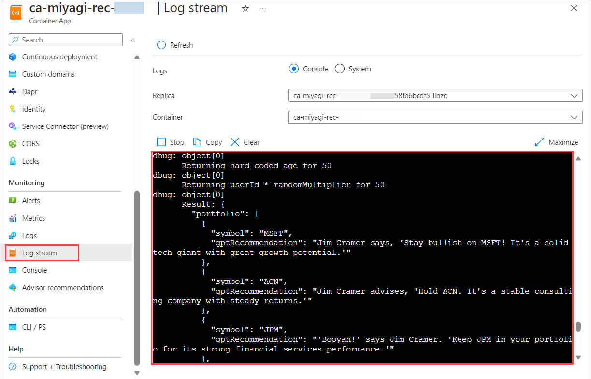

    > **Note**: Navigate back to VS code, from the Terminal select Node terminal, press Ctrl + C to stop the recommendation service ui page. 
   

## Summary

In this lab, you have updated the Containerized Recommendation service endpoint in Miyagi UI and verified it locally.
