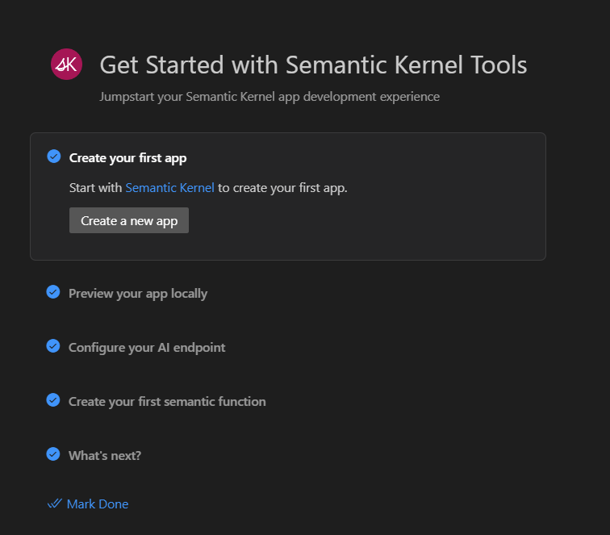
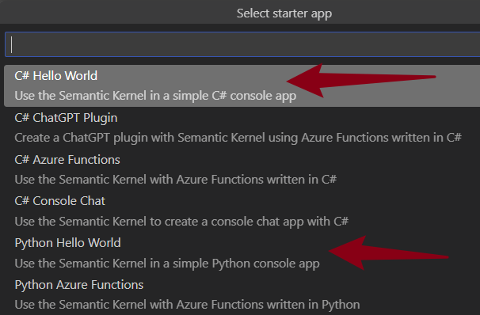
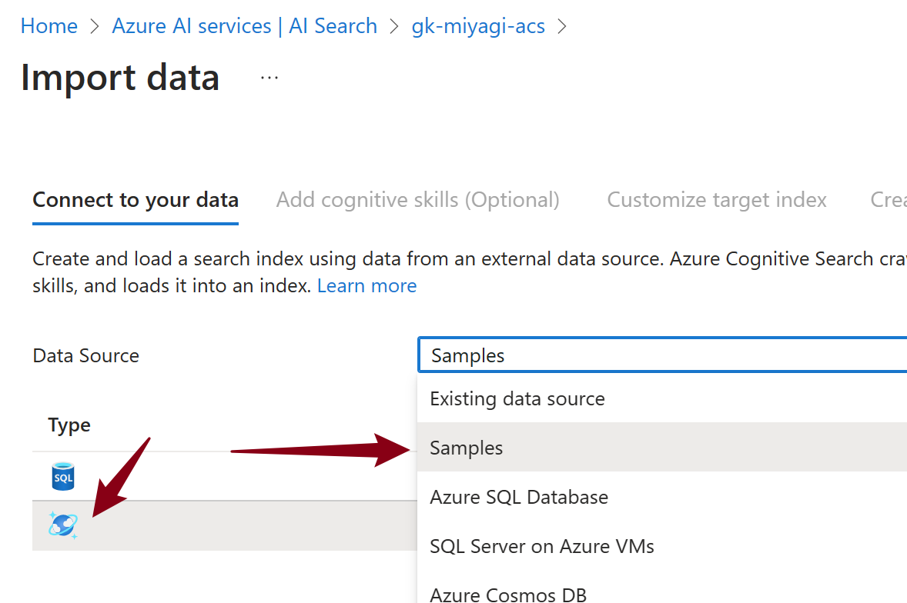
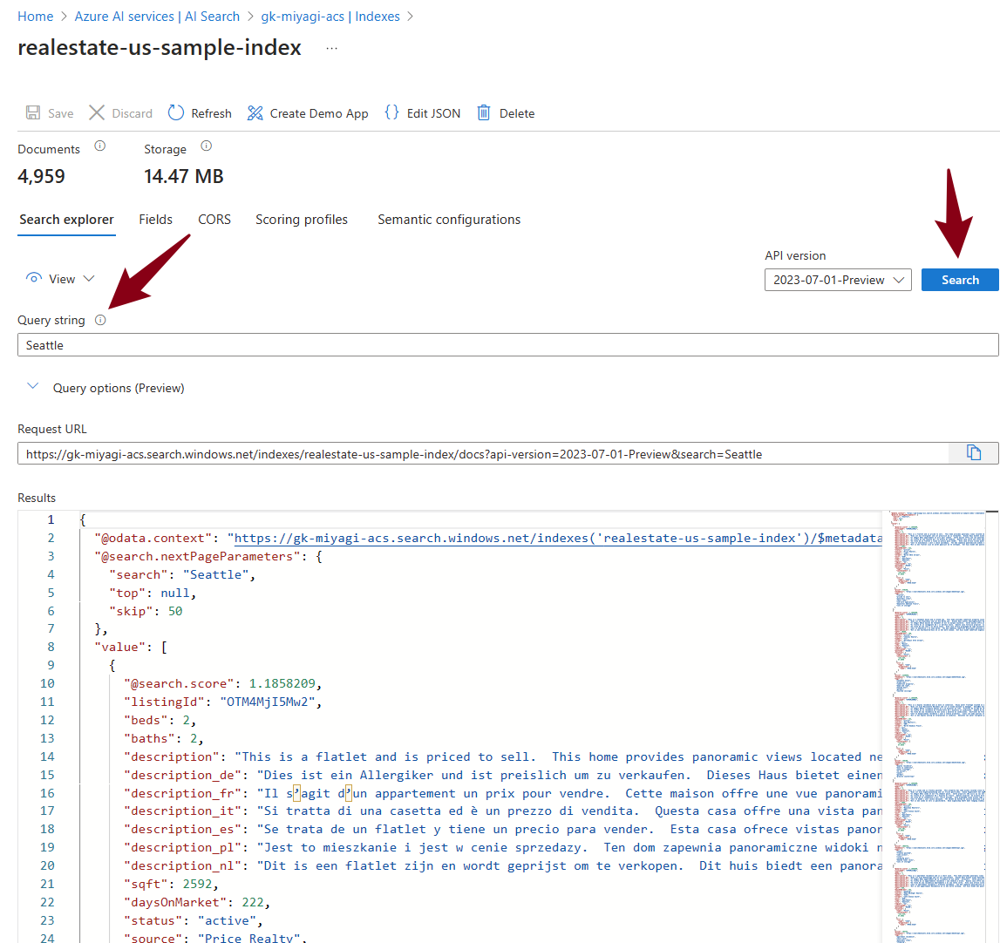

# Getting Started with Your Own Copilot

## 0. Prerequisites

> Ensure that the prerequisites mentioned [in Build and Run Miyagi](../02-build-and-run-miyagi/README.md/#1-setup-local-environment) are completed.

## 1. Configure and Run the Semantic Kernel Sample

1. Open a new window in VSCode and select the Semantic Kernel plugin from the left panel.
1. Under `AI Endpoints (Azure OpenAI)`, click on `Sign in to Azure` and follow the prompts to sign in.
1. From the `Functions` panel, click on the `Get started` icon and follow the wizard to create your app with the semantic function:
   
1. Choose either the `C# Hello World` or `Python Hello World` sample.
   
1. Follow the `README` in the Hello World starter and configure it with your `Azure OpenAI` endpoint.
1. Run the sample application after configuring.

## 2. Configure Azure Cognitive Search

1. From the Azure Portal, create and provision Azure Cognitive Search.
1. Click on the `Import data` button at the top of the Overview blade.
1. Follow the wizard to import the Cosmos DB `hotels-sample`.
   
1. Accept the defaults and create the `realestate-us-sample-indexer`.
1. Go to the `realestate-us-sample-index` and verify that documents are indexed by searching for `Seattle`.
   

> The sections below are optional.

### 3. Add a Memory Store to the Starter Sample 

1. Similar to [Getting Started with the RaG Notebook](../../../sandbox/usecases/rag/dotnet/Getting-started.ipynb), create a `MemoryBuilder` instance similar to:

   ```cs
   var memoryBuilder = new MemoryBuilder();
   memoryBuilder
      .WithAzureTextEmbeddingGenerationService(
         env["AZURE_OPENAI_EMBEDDING_MODEL"],
         env["AZURE_OPENAI_ENDPOINT"],
         env["AZURE_OPENAI_API_KEY"]
      )
      .WithMemoryStore(
         new AzureCognitiveSearchMemoryStore(
               env["AZURE_COGNITIVE_SEARCH_ENDPOINT"],
               env["AZURE_COGNITIVE_SEARCH_API_KEY"]
         )
      );

   var memory = memoryBuilder.Build();
   ```

2. Retrieve the `AZURE_OPENAI_EMBEDDING_MODEL` from Azure OpenAI's model deployment and update the environment variables.

3. Similarly, obtain the `AZURE_COGNITIVE_SEARCH_ENDPOINT` and `AZURE_COGNITIVE_SEARCH_API_KEY` from the recently provisioned Azure Cognitive Search instance.

### 4. Perform Retrieval-Augmented Generation (RaG) Using the Semantic Kernel

1. Import the `TextMemoryPlugin` and update the Semantic Function (Prompt template) with `{recall $fact1}` in a manner akin to the Semantic Kernel's [C#](https://github.com/microsoft/semantic-kernel/blob/main/dotnet/notebooks/06-memory-and-embeddings.ipynb) or [Python](https://github.com/microsoft/semantic-kernel/blob/main/python/notebooks/06-memory-and-embeddings.ipynb) notebooks.
