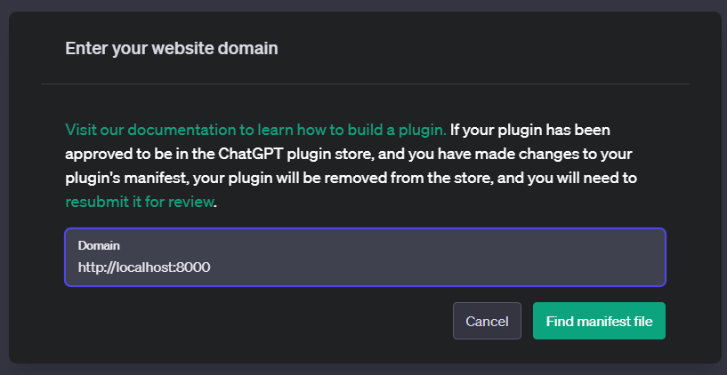
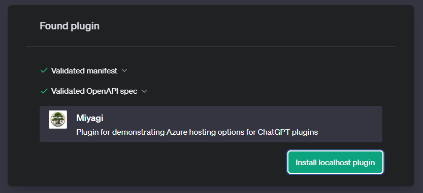
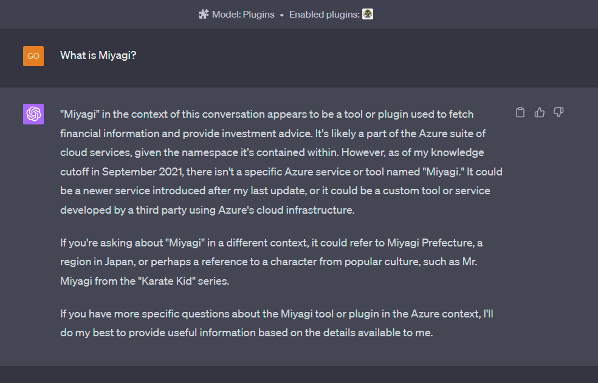

# Miyagi Bing and ai.com Plugin

Showcases how to build a [Bing](https://bing.com) and [ai.com](https://ai.com) plugin and host it securely in Azure.

### Examples

This plugin showcases a financial advisor app, and since it is accessible publicly from Bing and ChatGPT, it will answer
general questions about investment allocation. For the next phase, it will have
user authentication and will be able to answer questions about the user's portfolio.

- "Given current marco conditions, is it better to invest in stocks or bonds?"
- "Is MSFT a good purchase?"
- "Best way to invest $1000?"
- "Most optimal retirement plan?"

### Setup

1. Populate the `.env.example` file with your Bing API and OpenAPI keys and rename it to `.env`
1. (Optional) Register for a free API Key with FMP to fetch stock information and update `.env`
1. In a terminal or codespaces, run the following command:
    ```
    poetry install && poetry run dev 
    ```
1. Install the plugin from [Bing](https://bing.com) or [ai.com](https://ai.com).

#### ChatGPT

1. Go to [ai.com](https://ai.com) and from New Chat, under GPT-4, select Plugins
1. From the Plugin store dialog, Click on `Develop your own plugin`
1. Under Domain, enter `http://localhost:8000` and click on `Find Manifest`

1. Install localhost plugin

1. Select plugin and interact


