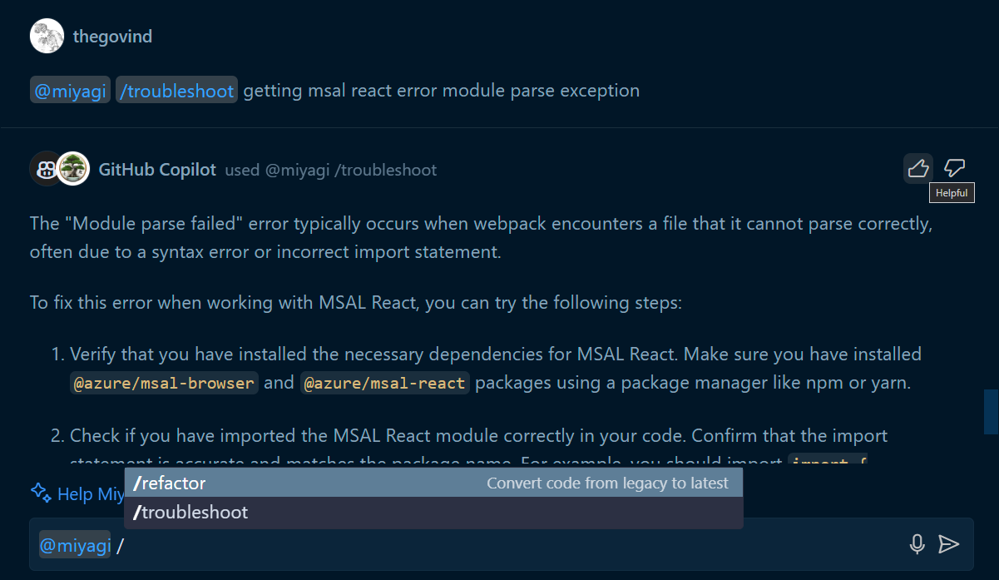

# Miyagi Code Modernization VS Code Extension

This sample shows

- How to contribute a chat agent.
- How to use the chatRequestAccess API to request access to the chat.
- How to respond with follow-ups.

Based on VS Code's [extension sample](https://github.com/microsoft/vscode-extension-samples/).

## Running the Sample

- Run `npm install` in terminal to install dependencies
- Run the `Run Extension` target in the Debug View. This will:
	- Start a task `npm: watch` to compile the code
	- Run the extension in a new VS Code window
