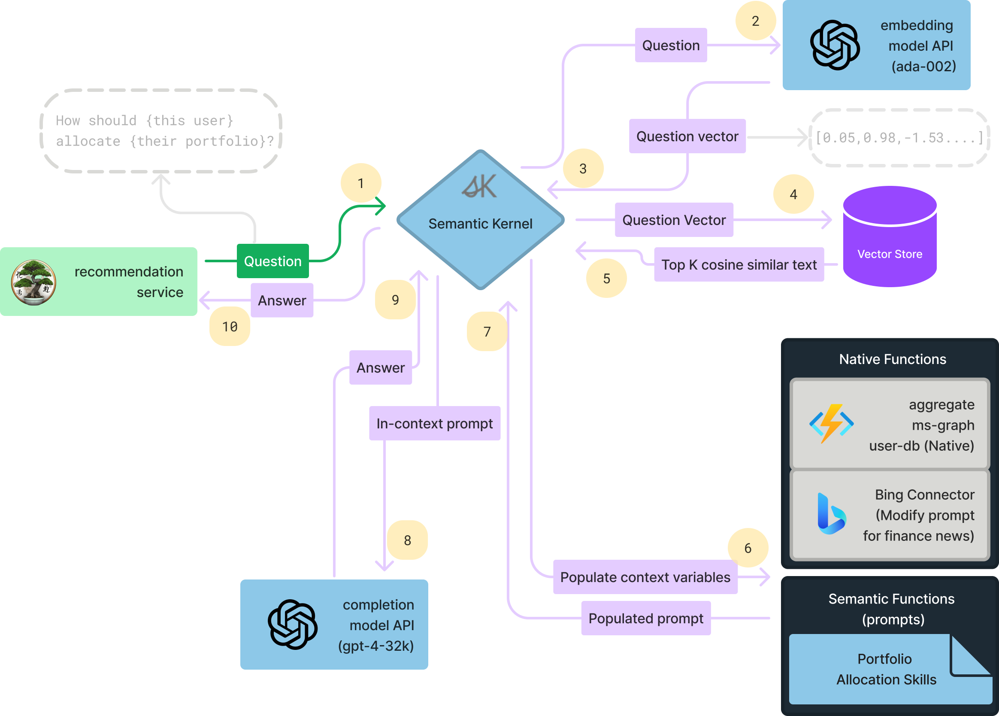

# Recommendation Service

Microservice that leverages Semantic Kernel to orchestrate the recommendation flow with native and semantic functions,
along with vector stores and connectors. The key aspects of this service will be distilled in
the [Synthesis use case](https://iappwksp.com/wksp/05-use-cases/synthesis/)

> Tip: For advanced deep learning-based recommender systems,
> checout [microsoft/recommenders](https://github.com/microsoft/recommenders#algorithms) for complex DLRMs.

## Overview



## Getting Started

Set the following environment variables:

```bash
dotnet user-secrets set "BING_API_KEY" ""
dotnet user-secrets set "deploymentOrModelId" ""
dotnet user-secrets set "embeddingDeploymentOrModelId" ""
dotnet user-secrets set "endpoint" "https://{}.openai.azure.com/"
dotnet user-secrets set "apiKey" ""
dotnet user-secrets set "QDRANT_ENDPOINT" "http://localhost"
dotnet user-secrets set "QDRANT_PORT" "6333"
dotnet user-secrets set "QDRANT_MEMORY_COLLECTION" ""

```
